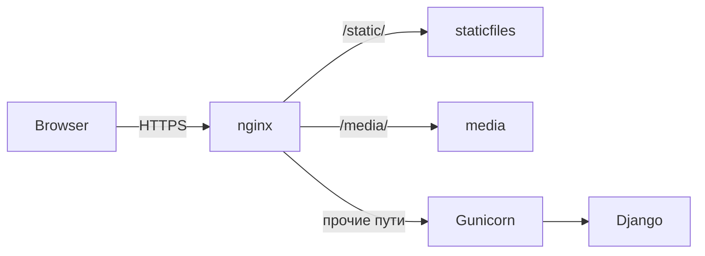

# Иерархия папок и перенос сайта Candels в интернет

Документ описывает, **как обычно устроены каталоги на сервере** при выкладке этого проекта (Django), и как **логически разделить бэкенд и фронтенд**. Конкретные пути на VPS могут отличаться; важно сохранить соответствие переменным `BASE_DIR`, `STATIC_ROOT` и `MEDIA_ROOT` в `config/settings.py`.

---

## 1. Как устроен проект

Candels — **Django-приложение с серверным рендерингом (SSR)**: HTML собирается на сервере из шаблонов. Отдельного фронтенд-сборщика (как у SPA на React/Vue) нет.

- **«Фронтенд» в смысле продукта** — то, что видит браузер: HTML из шаблонов, CSS и JS из статики.
- **«Бэкенд»** — Python, Django, база данных, бизнес-логика, админка, загрузка файлов.

---

## 2. Бэкенд и фронтенд: что к чему относится

### Бэкенд (сервер приложения)

| Компонент | Где в репозитории / на сервере |
|-----------|--------------------------------|
| Точка входа WSGI/ASGI | `config/wsgi.py`, `config/asgi.py` |
| Настройки | `config/settings.py`, `config/urls.py` |
| Код приложений | `apps/core`, `apps/accounts`, `apps/catalog`, `apps/cart`, `apps/orders` |
| Управление | `manage.py` |
| Зависимости | `requirements.txt` |
| Окружение Python | виртуальное окружение на сервере (например `.venv/` или `/srv/candels/venv/`) — **создаётся на сервере**, не копируется с домашнего ПК |
| База данных | В разработке по умолчанию SQLite: файл `db.sqlite3` рядом с `BASE_DIR`. В production обычно **PostgreSQL** (или другой сервер БД): строка подключения задаётся в `DATABASES` в `settings` / через переменные окружения |

### Фронтенд (представление для браузера)

| Компонент | Назначение |
|-----------|------------|
| `templates/` | Шаблоны Django (`.html`), рендерятся **на бэкенде** |
| `static/` | Исходные CSS/JS и структура по разделам сайта (`core/`, `catalog/`, `cart/`, `orders/`) |
| `staticfiles/` | **Только production**: каталог из `STATIC_ROOT` (`BASE_DIR / "staticfiles"`), заполняется командой `collectstatic` |
| `media/` | Загружаемые файлы (`MEDIA_ROOT`), например фото товаров в `media/products/`; в production их раздаёт **nginx** (или другой веб-сервер), а не обязательно Django |

---

## 3. Пример иерархии на VPS

Ниже условный пример: корень деплоя `/srv/candels/`, код приложения в подпапке `app/`.

```text
/srv/candels/
├── venv/                          # виртуальное окружение Python (создать на сервере)
├── app/                           # клон репозитория (или rsync артефакта без мусора)
│   ├── manage.py
│   ├── config/
│   ├── apps/
│   ├── templates/
│   ├── static/                    # исходники статики (из git)
│   ├── staticfiles/               # после python manage.py collectstatic (часто не в git)
│   ├── media/                     # загрузки пользователей/админки; бэкап отдельно
│   │   └── products/              # фото товаров (ImageField upload_to="products/")
│   ├── requirements.txt
│   └── .env                       # секреты только на сервере, не в git
├── logs/                          # опционально: логи gunicorn / приложения
└── ...
```

- **`BASE_DIR`** в Django — это каталог, где лежит `manage.py` (в примере — `app/`).
- **`STATIC_ROOT`** = `app/staticfiles` — сюда складывается объединённая статика для раздачи через nginx.
- **`MEDIA_ROOT`** = `app/media` — сюда пишутся загруженные файлы.

Пути `/srv/candels` и имя `app` можно заменить на свои; логика та же.

---

## 4. Кто что отдаёт: nginx и Gunicorn

Типичная схема:

- **nginx** слушает 443 (HTTPS), отдаёт статику и медиа с диска, остальные запросы проксирует на процесс приложения.
- **Gunicorn** (или uvicorn для ASGI) запускает WSGI/ASGI-приложение Django.

| URL-префикс | Кто отдаёт | Физический путь (пример) |
|-------------|------------|---------------------------|
| `/static/` | nginx | `.../app/staticfiles/` |
| `/media/` | nginx | `.../app/media/` |
| `/`, `/catalog/`, `/accounts/`, … | прокси → Gunicorn | Django рендерит страницы |
| `/secure-admin/` | прокси → Gunicorn | Django admin (см. `config/urls.py`) |

В режиме `DEBUG=True` Django может сам отдавать `static` и `media`; **в production** это отключают и раздают через nginx (или WhiteNoise — отдельная тема).

---

## 5. Что переносить и чего не копировать

### Переносить на сервер

- Исходный код: `config/`, `apps/`, `templates/`, `static/`, `manage.py`, `requirements.txt`
- Миграции: `apps/*/migrations/` (кроме пустых `__init__.py` по необходимости)
- Файл окружения: `.env` (создать на сервере по образцу `.env.example`, не коммитить)

### Не копировать с машины разработчика

- `.venv/` или другое локальное виртуальное окружение — **пересоздать на сервере**
- `__pycache__/`, `*.pyc`
- Локальный `db.sqlite3` — если переходите на PostgreSQL, переносите данные через `dumpdata`/`loaddata` или миграции + начальные фикстуры
- При минимальном деплое иногда не кладут `.git/` на прод-сервер (по политике команды)

### Команды на сервере (порядок обычно такой)

1. Создать venv, установить зависимости: `pip install -r requirements.txt`
2. Настроить `.env` (`SECRET_KEY`, `DEBUG=False`, `ALLOWED_HOSTS`, БД, `CSRF_TRUSTED_ORIGINS`, контакты магазина и т.д.)
3. `python manage.py migrate`
4. `python manage.py collectstatic` (при необходимости с `--noinput`)
5. `python manage.py createsuperuser` — учётная запись для `/secure-admin/`
6. Запуск воркеров Gunicorn и настройка nginx + systemd (или аналог)

---

## 6. Сводка: папки репозитория Candels

| Путь | Роль |
|------|------|
| `templates/` | HTML-шаблоны, рендер на сервере |
| `static/` | Исходники CSS/JS (разработка и источник для collectstatic) |
| `staticfiles/` | Сборка статики для production (появляется после `collectstatic`) |
| `media/` | Загрузки (фото товаров и т.п.), в проде — резервное копирование |
| `apps/`, `config/` | Бэкенд-логика и маршруты |

---

## 7. Схема потока запросов (mermaid)



---

*Документ носит справочный характер и не заменяет точную конфигурацию вашего хостинга, CI/CD и секретов.*
