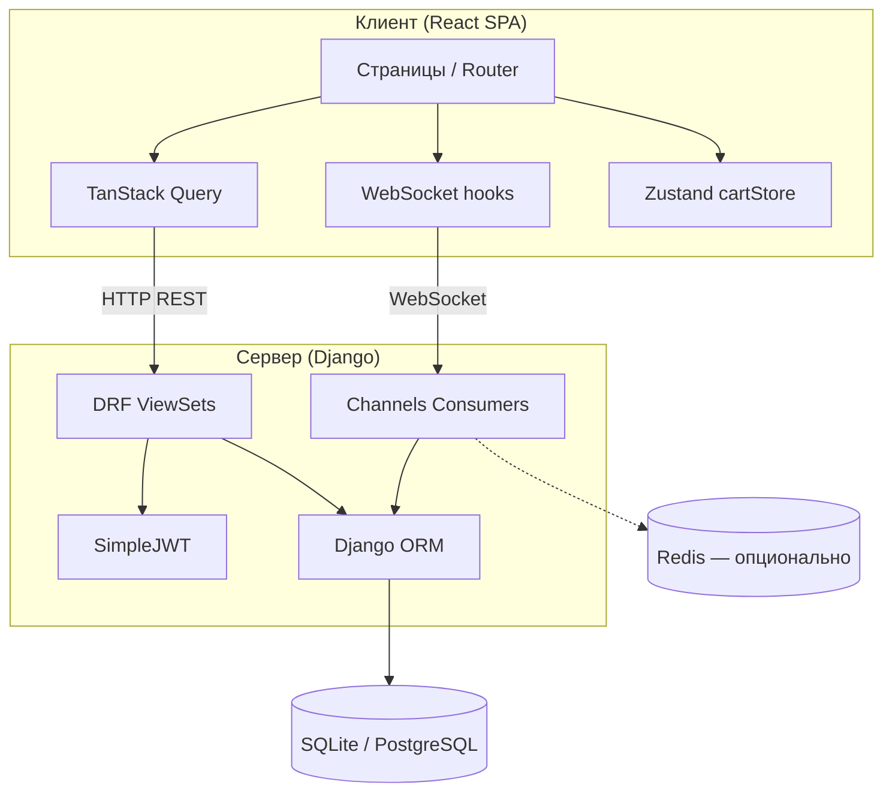

# Архитектура системы (траектория В)

## Общая схема

## Слои backend

| Слой | Компоненты |
|------|------------|
| Presentation | ViewSet, Serializer, Consumers |
| Business | permissions, signals, queryset filters |
| Data | Models, migrations |
| Infrastructure | settings, ASGI, routing |

## Слои frontend

| Слой | Компоненты |
|------|------------|
| UI | pages/, components/ |
| State | AuthContext, cartStore, React Query cache |
| API | api/client.js (Axios + interceptors) |
| Real-time | useNotifications, ReviewList WebSocket |

## Поток аутентификации

1. Пользователь вводит email/пароль → `POST /api/auth/login/`.
2. Сервер возвращает access (короткий) и refresh (длинный) токены.
3. Клиент сохраняет токены в localStorage.
4. Axios interceptor добавляет `Authorization: Bearer <access>`.
5. При 401 — запрос `POST /api/auth/token/refresh/`, повтор исходного запроса.

## Поток оформления заказа

1. Добавление в корзину → `POST /api/carts/add_item/`.
2. Просмотр корзины → `GET /api/carts/`.
3. Оформление → `POST /api/orders/` (создание Order + OrderItem, очистка корзины).
4. Уведомление автору → Notification + WebSocket push.

## Развёртывание

- **Разработка:** `runserver` (backend) + `npm run dev` (frontend, proxy на API).
- **Продакшен:** Gunicorn/Uvicorn + Nginx для статики SPA и проксирования API/WebSocket.
