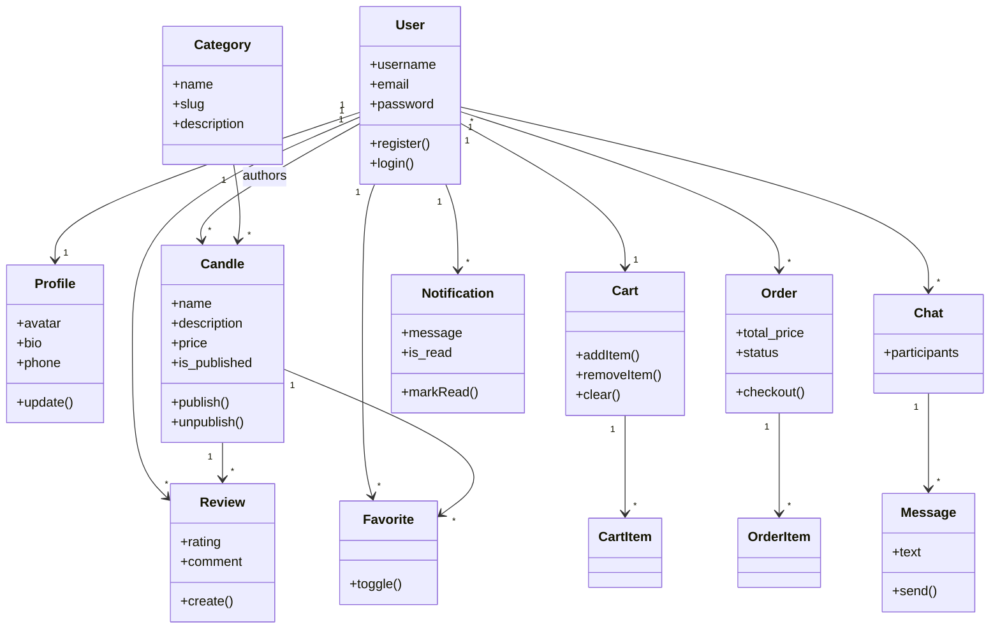

# Доменная модель

## Агрегаты

| Агрегат | Корневая сущность | Инварианты |
|---------|-------------------|------------|
| Каталог | Candle | цена > 0; категория обязательна |
| Заказ | Order | сумма = Σ позиций; статус из enum |
| Корзина | Cart | одна корзина на пользователя |
| Отзыв | Review | рейтинг 1–5; один отзыв на пару user+candle |
