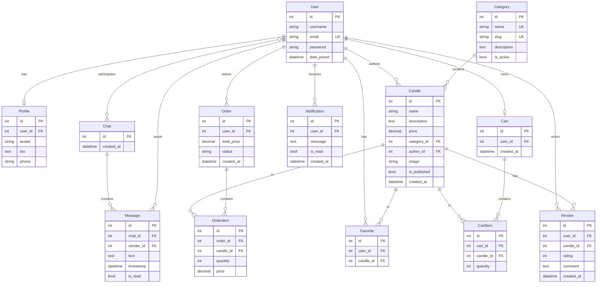

# ER-диаграмма базы данных

## Ограничения целостности

- `Review`: уникальная пара `(user, candle)` — один отзыв на свечу от пользователя.
- `Favorite`: уникальная пара `(user, candle)`.
- `Cart`: OneToOne с User — одна корзина на пользователя.
- `Candle.category`: PROTECT — нельзя удалить категорию с товарами.
- `Candle.author`: SET_NULL — при удалении автора свеча сохраняется.
