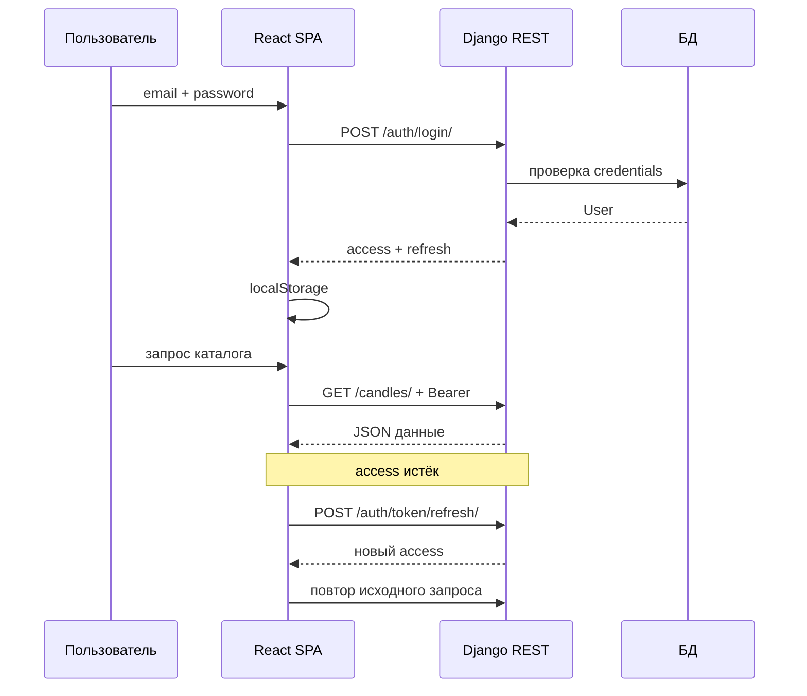

# Проектирование JWT-аутентификации

## Выбор схемы

Для траектории В используется **stateless JWT** (библиотека `djangorestframework-simplejwt`):

- **Access token** — короткоживущий, передаётся в заголовке каждого запроса.
- **Refresh token** — долгоживущий, используется только для получения нового access.

## Endpoints

```
POST /api/auth/register/     → создание User + Profile
POST /api/auth/login/        → { access, refresh }
POST /api/auth/token/refresh/ → { access }
GET  /api/auth/profile/      → данные пользователя (требует access)
POST /api/token/verify/      → проверка валидности токена
```

## Настройки (settings.py)

- `REST_FRAMEWORK['DEFAULT_AUTHENTICATION_CLASSES']`: `JWTAuthentication`
- `SIMPLE_JWT`: время жизни access/refresh, алгоритм HS256
- `AUTH_USER_MODEL = 'users.User'`

## Клиентская реализация (frontend/src/api/client.js)

1. При логине — сохранение `access` и `refresh` в `localStorage`.
2. Request interceptor — подстановка Bearer-токена.
3. Response interceptor — при 401 попытка refresh и повтор запроса.
4. При неудачном refresh — logout, редирект на `/login`.

## Безопасность

- Пароли хранятся как Django hash (PBKDF2).
- HTTPS в продакшене обязателен для защиты токенов.
- CORS настроен только для доверенных origin (localhost:5173).
- `token_blacklist` подключён для возможности инвалидации refresh-токенов.

## Диаграмма последовательности


