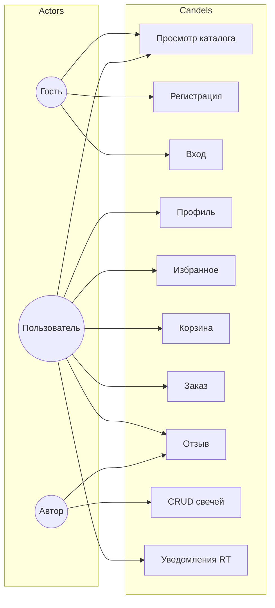

# Use Case диаграмма

## Спецификации прецедентов

### UC-01 Просмотр каталога

| Поле | Значение |
|------|----------|
| Актор | Гость, Пользователь |
| Предусловие | Backend запущен |
| Основной поток | 1. Открыть /catalog 2. API GET /candles/ 3. Отобразить карточки |
| Постусловие | Список свечей на экране |

### UC-02 Регистрация

| Поле | Значение |
|------|----------|
| Актор | Гость |
| Основной поток | 1. Форма register 2. POST /auth/register/ 3. Redirect login |
| Альтернатива | Email занят → сообщение об ошибке |

### UC-03 JWT-вход

| Поле | Значение |
|------|----------|
| Актор | Пользователь |
| Основной поток | 1. POST /auth/login/ 2. Сохранить токены 3. Доступ к защищённым страницам |

### UC-09 CRUD своих свечей

| Поле | Значение |
|------|----------|
| Актор | Автор |
| Предусловие | JWT valid |
| Основной поток | Create/Update/Delete через /candles/ и /candles/mine/ |
| Ограничение | Только author == current user |

### UC-10 Real-time уведомления

| Поле | Значение |
|------|----------|
| Актор | Пользователь |
| Основной поток | 1. WebSocket connect 2. Событие на сервере 3. Push в UI |
