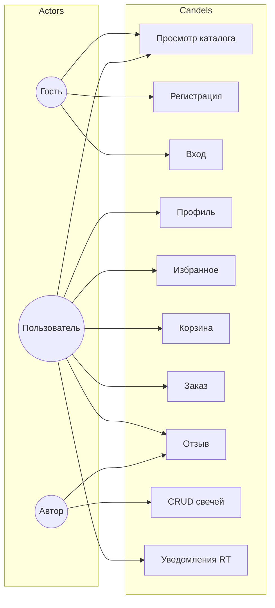
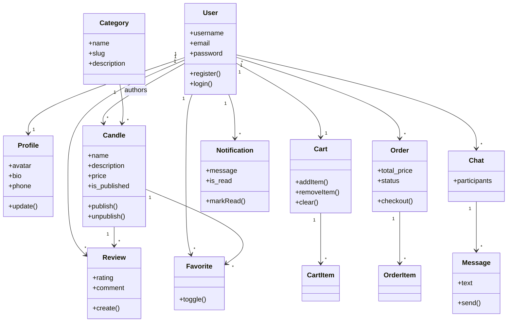
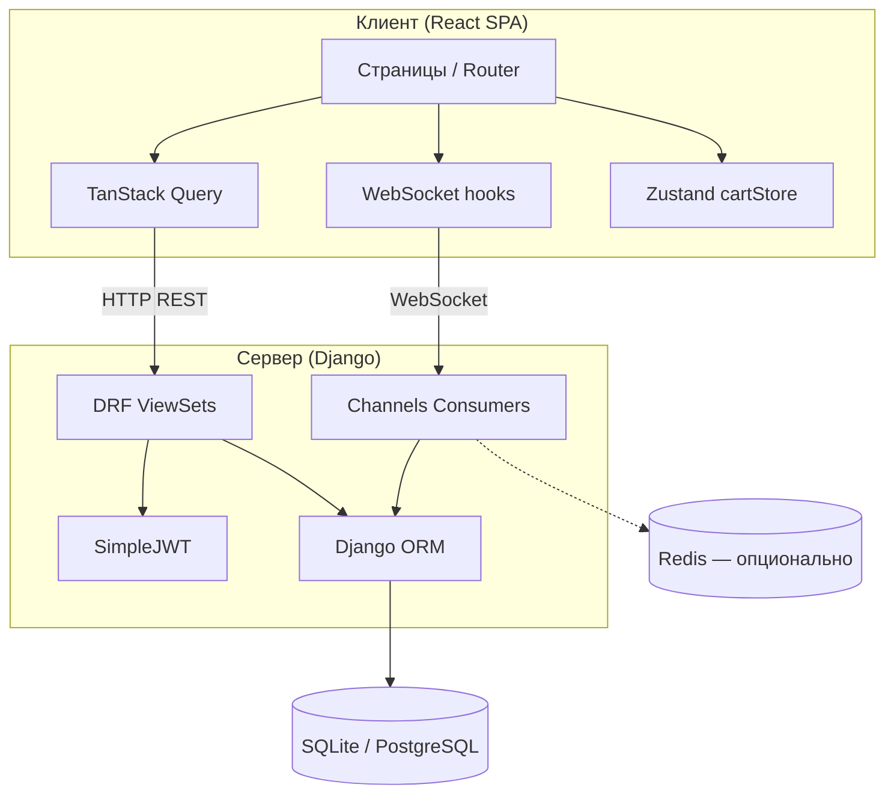
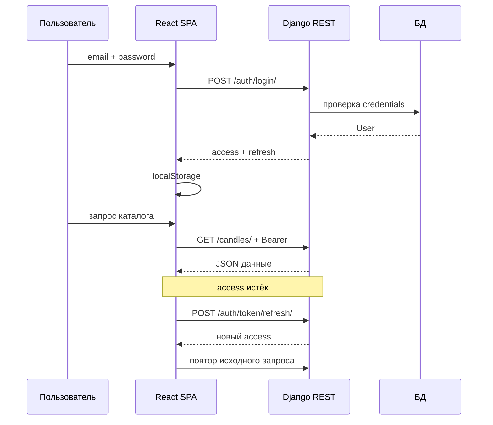
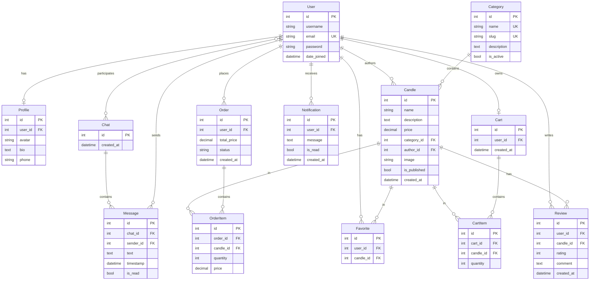

# ПОЯСНИТЕЛЬНАЯ ЗАПИСКА

**к курсовому проекту**  
по дисциплине «Технология разработки программного обеспечения»

**Тема:** Интернет-магазин свечей ручной работы «Candels»  
**Студент:** Рашевский Р.Р., группа ПИЖ-б-о-24-1  
**Руководитель:** к.т.н. Самойлов Ф.В.  
**Траектория:** В (Django REST + React SPA + JWT + WebSocket + Redis)

---


## СОДЕРЖАНИЕ

Введение

1. Аналитическая часть
2. Проектная часть
3. Реализационная часть
4. Тестирование и обеспечение качества
5. Развёртывание и эксплуатация
6. Управление проектом

Заключение
Список использованных источников
Приложения


## ВВЕДЕНИЕ

### Актуальность

Курсовой проект выполнен в рамках дисциплины «Технология разработки программного обеспечения» по **траектории В** методических указаний СКФУ. Траектория В предполагает разработку клиент-серверного веб-приложения с разделением на backend (Django REST Framework), frontend (React SPA), JWT-аутентификацией, оптимистичными обновлениями интерфейса, кэшированием данных и поддержкой WebSocket через Django Channels.

Рост сегмента электронной коммерции в нише товаров ручной работы (handmade) обусловливает спрос на специализированные платформы. Покупатели выбирают уникальные изделия с возможностью связи с мастером. Маркетплейсы общего назначения не обеспечивают узкой специализации и инструментов real-time коммуникации. Платформа «Candels» объединяет мастеров-свечников и покупателей в единой цифровой среде.

### Цель и задачи

**Цель работы** — повышение уровня профессиональной подготовки путём проектирования, реализации и документирования современного веб-приложения на базе Django и React в соответствии с требованиями траектории В.

**Задачи работы** (по заданию на курсовой проект):

1. Провести предпроектное обследование предметной области интернет-магазина handmade-свечей.
2. Сформулировать функциональные и нефункциональные требования к системе.
3. Обосновать выбор технологического стека (Django, DRF, React, Channels, JWT, PostgreSQL/SQLite, Redis).
4. Разработать доменную модель, Use Case диаграмму, ER-диаграмму и архитектуру системы.
5. Реализовать модели данных, REST API, JWT-аутентификацию и React SPA.
6. Реализовать WebSocket-уведомления, оптимистичные обновления UI и кэширование (React Query).
7. Провести модульное, интеграционное и системное тестирование, нагрузочное тестирование WebSocket.
8. Подготовить эксплуатационную документацию и пояснительную записку по ГОСТ.

### Объект и предмет исследования

**Объект исследования** — процессы электронной коммерции в сегменте товаров ручной работы.

**Предмет исследования** — методы и технологии проектирования и разработки клиент-серверных веб-приложений с поддержкой real-time взаимодействия.

**Методы исследования:** анализ предметной области и аналогов, объектно-ориентированное проектирование (UML), проектирование REST API, прототипирование SPA, модульное и интеграционное тестирование, нагрузочное тестирование WebSocket-соединений.

**Практическая значимость** — получен программный продукт, демонстрирующий полный цикл разработки по траектории В и пригодный для дальнейшего развития.

Объём пояснительной записки соответствует требованию методических указаний: 3–4 печатных листа (48–64 страницы формата А4) при оформлении по ГОСТ 7.32-2017.


## 1. АНАЛИТИЧЕСКАЯ ЧАСТЬ

### 1.1. Описание предметной области

Candels — специализированный интернет-магазин свечей ручной работы. Платформа объединяет мастеров, создающих уникальные свечи, с покупателями, ценящими handmade-продукцию. Система обеспечивает продажу готовых изделий, взаимодействие через отзывы, избранное, уведомления в реальном времени и подготовленную серверную инфраструктуру для чата между участниками.

Рынок декоративных и ароматических свечей в России демонстрирует устойчивый рост. Потребители переходят от массовых товаров к авторским изделиям. Существующие маркетплейсы не предоставляют узкой специализации и инструментов real-time коммуникации между мастером и покупателем.

**Участники системы:**

| Роль | Описание | Основные действия |
|------|----------|-------------------|
| Гость | Неаутентифицированный посетитель | Просмотр каталога, регистрация, вход |
| Покупатель | Зарегистрированный пользователь | Корзина, заказы, отзывы, избранное |
| Мастер (автор) | Создатель свечей | CRUD своих публикаций, уведомления о заказах |
| Администратор | Сотрудник через Django Admin | Модерация контента, управление категориями |

### 1.2. Анализ бизнес-процессов (IDEF0)

На верхнем уровне IDEF0 процесс «Продажа handmade-свечи через Candels» (A0) декомпозируется на подпроцессы:

| Код | Подпроцесс | Входы | Выходы | Механизм |
|-----|------------|-------|--------|----------|
| A1 | Регистрация и аутентификация | Данные пользователя | JWT-токены, сессия SPA | Django, SimpleJWT |
| A2 | Управление каталогом | Карточка свечи, изображение | Опубликованные товары | CandleViewSet, React |
| A3 | Оформление заказа | Корзина, позиции | Order, OrderItem | OrderViewSet, Zustand |
| A4 | Обратная связь и уведомления | Отзыв, событие заказа | Review, Notification, WS push | Channels, consumers |

Каждый подпроцесс трассируется к модулям backend и страницам frontend. Диаграмма IDEF0 верхнего уровня отражает сквозной бизнес-процесс от регистрации до получения обратной связи.

### 1.3. SWOT-анализ текущего состояния

| | Положительные | Отрицательные |
|---|---------------|---------------|
| **Внутренние (S/W)** | Современный стек (React, DRF, Channels); модульная архитектура; JWT и permissions; OpenAPI документация | Ограниченный объём автотестов frontend; SQLite в dev-среде; UI чата не реализован |
| **Внешние (O/T)** | Рост спроса на handmade; требования МУ совпадают с траекторией В | Конкуренция маркетплейсов; необходимость платёжной интеграции в production |

**Вывод:** проект целесообразен как учебная реализация траектории В и как основа коммерческого MVP.

### 1.4. Анализ аналогов и конкурентов

| Аналог | Преимущества | Недостатки | Оценка |
|--------|--------------|------------|--------|
| Etsy | Мировая аудитория, инфраструктура | Высокая комиссия, нет фокуса на свечах, нет WebSocket-чата | 7/10 |
| Wildberries / Ozon | Масштаб, логистика | Нет handmade-ниши, нет CRUD для авторов | 6/10 |
| Instagram-магазины | Прямой контакт с мастером | Нет единого каталога, корзины, API | 5/10 |
| Локальные мастерские | Персонализация | Отсутствие автоматизации заказов | 6/10 |
| Самописная платформа Candels | Полный контроль, REST+SPA+WS, специализация | Требует разработки и сопровождения | 9/10 |

### 1.5. Обоснование необходимости разработки

Необходима специализированная платформа с REST API, SPA, JWT, WebSocket и CRUD публикаций автора — требования траектории В. Candels закрывает пробел между маркетплейсами общего назначения и разрозненными каналами продаж мастеров.

### 1.6. Экономическое обоснование (ROI)

Для учебного проекта экономический эффект выражается в приобретении компетенций full-stack разработки и готовом MVP. Для коммерческого использования платформа снижает комиссию посредников (по сравнению с Etsy 6,5–10 %), позволяет мастерам напрямую управлять каталогом и получать уведомления о заказах в реальном времени. Затраты на разработку — труд студента в рамках КП; эксплуатация в dev-режиме — бесплатные инструменты (SQLite, InMemory Channel Layer). В production рекомендуется PostgreSQL и Redis через переменные окружения без дополнительных платных сервисов.


## 2. ПРОЕКТНАЯ ЧАСТЬ

### 2.1. Модель требований к ПО

#### 2.1.1. Use Case диаграмма



## Спецификации прецедентов

### UC-01 Просмотр каталога

| Поле | Значение |
|------|----------|
| Актор | Гость, Пользователь |
| Предусловие | Backend запущен |
| Основной поток | 1. Открыть /catalog 2. API GET /candles/ 3. Отобразить карточки |
| Постусловие | Список свечей на экране |

### UC-02 Регистрация

| Поле | Значение |
|------|----------|
| Актор | Гость |
| Основной поток | 1. Форма register 2. POST /auth/register/ 3. Redirect login |
| Альтернатива | Email занят → сообщение об ошибке |

### UC-03 JWT-вход

| Поле | Значение |
|------|----------|
| Актор | Пользователь |
| Основной поток | 1. POST /auth/login/ 2. Сохранить токены 3. Доступ к защищённым страницам |

### UC-09 CRUD своих свечей

| Поле | Значение |
|------|----------|
| Актор | Автор |
| Предусловие | JWT valid |
| Основной поток | Create/Update/Delete через /candles/ и /candles/mine/ |
| Ограничение | Только author == current user |

### UC-10 Real-time уведомления

| Поле | Значение |
|------|----------|
| Актор | Пользователь |
| Основной поток | 1. WebSocket connect 2. Событие на сервере 3. Push в UI |

#### 2.1.2. Спецификация прецедентов


#### UC-01. Регистрация

| Элемент | Описание |
|---------|----------|
| Идентификатор | UC-01 |
| Название | Регистрация |
| Актор | Гость |
| Предусловие | Открыта страница /register |
| Основной поток | 1. Заполнить форму. 2. POST /api/auth/register/. 3. Redirect на /login. |
| Постусловие | Создан User и Profile |
| Альтернативный поток | Email занят → ошибка 400 |

Прецедент UC-01 относится к функциональным требованиям интернет-магазина Candels и проверяется на этапе системного тестирования. Взаимодействие пользователя с системой реализовано через React SPA и REST API Django REST Framework. Ошибки валидации возвращаются в формате JSON с кодами HTTP 400/401/403/404 в соответствии со стандартами REST.

#### UC-02. JWT-вход

| Элемент | Описание |
|---------|----------|
| Идентификатор | UC-02 |
| Название | JWT-вход |
| Актор | Покупатель |
| Предусловие | Учётная запись существует |
| Основной поток | 1. POST /api/auth/login/. 2. Сохранить access/refresh в localStorage. 3. Доступ к защищённым маршрутам. |
| Постусловие | Токены сохранены |
| Альтернативный поток | Неверный пароль → 401 |

Прецедент UC-02 относится к функциональным требованиям интернет-магазина Candels и проверяется на этапе системного тестирования. Взаимодействие пользователя с системой реализовано через React SPA и REST API Django REST Framework. Ошибки валидации возвращаются в формате JSON с кодами HTTP 400/401/403/404 в соответствии со стандартами REST.

#### UC-03. Просмотр каталога

| Элемент | Описание |
|---------|----------|
| Идентификатор | UC-03 |
| Название | Просмотр каталога |
| Актор | Гость, Покупатель |
| Предусловие | Backend доступен |
| Основной поток | 1. GET /api/candles/?page=&search=&category=. 2. Отобразить карточки с пагинацией. |
| Постусловие | Список свечей на экране |
| Альтернативный поток | Пустой результат → сообщение |

Прецедент UC-03 относится к функциональным требованиям интернет-магазина Candels и проверяется на этапе системного тестирования. Взаимодействие пользователя с системой реализовано через React SPA и REST API Django REST Framework. Ошибки валидации возвращаются в формате JSON с кодами HTTP 400/401/403/404 в соответствии со стандартами REST.

#### UC-04. Создание свечи

| Элемент | Описание |
|---------|----------|
| Идентификатор | UC-04 |
| Название | Создание свечи |
| Актор | Автор |
| Предусловие | JWT valid |
| Основной поток | 1. POST /api/candles/ с name, price, category, image. 2. author=current user. |
| Постусловие | Свеча создана |
| Альтернативный поток | 403 без авторизации |

Прецедент UC-04 относится к функциональным требованиям интернет-магазина Candels и проверяется на этапе системного тестирования. Взаимодействие пользователя с системой реализовано через React SPA и REST API Django REST Framework. Ошибки валидации возвращаются в формате JSON с кодами HTTP 400/401/403/404 в соответствии со стандартами REST.

#### UC-05. Редактирование своей свечи

| Элемент | Описание |
|---------|----------|
| Идентификатор | UC-05 |
| Название | Редактирование своей свечи |
| Актор | Автор |
| Предусловие | Candle.author == user |
| Основной поток | 1. PUT/PATCH /api/candles/{id}/. 2. Проверка IsAuthorOrReadOnly. |
| Постусловие | Данные обновлены |
| Альтернативный поток | 403 для чужой свечи |

Прецедент UC-05 относится к функциональным требованиям интернет-магазина Candels и проверяется на этапе системного тестирования. Взаимодействие пользователя с системой реализовано через React SPA и REST API Django REST Framework. Ошибки валидации возвращаются в формате JSON с кодами HTTP 400/401/403/404 в соответствии со стандартами REST.

#### UC-06. Добавление в корзину

| Элемент | Описание |
|---------|----------|
| Идентификатор | UC-06 |
| Название | Добавление в корзину |
| Актор | Покупатель |
| Предусловие | JWT valid |
| Основной поток | 1. Добавить в Zustand store. 2. POST /api/orders/ при оформлении. |
| Постусловие | Позиция в корзине |
| Альтернативный поток | — |

Прецедент UC-06 относится к функциональным требованиям интернет-магазина Candels и проверяется на этапе системного тестирования. Взаимодействие пользователя с системой реализовано через React SPA и REST API Django REST Framework. Ошибки валидации возвращаются в формате JSON с кодами HTTP 400/401/403/404 в соответствии со стандартами REST.

#### UC-07. Оформление заказа

| Элемент | Описание |
|---------|----------|
| Идентификатор | UC-07 |
| Название | Оформление заказа |
| Актор | Покупатель |
| Предусловие | Корзина не пуста |
| Основной поток | 1. POST /api/orders/ с items[]. 2. Order + OrderItems. 3. Уведомление автору. |
| Постусловие | Заказ создан |
| Альтернативный поток | Пустая корзина → ошибка |

Прецедент UC-07 относится к функциональным требованиям интернет-магазина Candels и проверяется на этапе системного тестирования. Взаимодействие пользователя с системой реализовано через React SPA и REST API Django REST Framework. Ошибки валидации возвращаются в формате JSON с кодами HTTP 400/401/403/404 в соответствии со стандартами REST.

#### UC-08. Отзыв на свечу

| Элемент | Описание |
|---------|----------|
| Идентификатор | UC-08 |
| Название | Отзыв на свечу |
| Актор | Покупатель |
| Предусловие | JWT valid |
| Основной поток | 1. POST /api/reviews/. 2. WS broadcast на канал свечи. |
| Постусловие | Review создан |
| Альтернативный поток | Повторный отзыв → unique constraint |

Прецедент UC-08 относится к функциональным требованиям интернет-магазина Candels и проверяется на этапе системного тестирования. Взаимодействие пользователя с системой реализовано через React SPA и REST API Django REST Framework. Ошибки валидации возвращаются в формате JSON с кодами HTTP 400/401/403/404 в соответствии со стандартами REST.

#### UC-09. Избранное toggle

| Элемент | Описание |
|---------|----------|
| Идентификатор | UC-09 |
| Название | Избранное toggle |
| Актор | Покупатель |
| Предусловие | JWT valid |
| Основной поток | 1. POST /api/favorites/toggle/. 2. Оптимистичное обновление UI. |
| Постусловие | Favorite создан/удалён |
| Альтернативный поток | — |

Прецедент UC-09 относится к функциональным требованиям интернет-магазина Candels и проверяется на этапе системного тестирования. Взаимодействие пользователя с системой реализовано через React SPA и REST API Django REST Framework. Ошибки валидации возвращаются в формате JSON с кодами HTTP 400/401/403/404 в соответствии со стандартами REST.

#### UC-10. Real-time уведомление

| Элемент | Описание |
|---------|----------|
| Идентификатор | UC-10 |
| Название | Real-time уведомление |
| Актор | Пользователь |
| Предусловие | WS подключён |
| Основной поток | 1. group_send → NotificationConsumer. 2. Клиент обновляет badge. |
| Постусловие | UI обновлён |
| Альтернативный поток | Reconnect при обрыве |

Прецедент UC-10 относится к функциональным требованиям интернет-магазина Candels и проверяется на этапе системного тестирования. Взаимодействие пользователя с системой реализовано через React SPA и REST API Django REST Framework. Ошибки валидации возвращаются в формате JSON с кодами HTTP 400/401/403/404 в соответствии со стандартами REST.

#### UC-11. WebSocket отзывы

| Элемент | Описание |
|---------|----------|
| Идентификатор | UC-11 |
| Название | WebSocket отзывы |
| Актор | Покупатель |
| Предусловие | Открыта страница свечи |
| Основной поток | 1. WS /ws/reviews/{candle_id}/. 2. Новый отзыв → обновление ReviewList. |
| Постусловие | Список отзывов актуален |
| Альтернативный поток | — |

Прецедент UC-11 относится к функциональным требованиям интернет-магазина Candels и проверяется на этапе системного тестирования. Взаимодействие пользователя с системой реализовано через React SPA и REST API Django REST Framework. Ошибки валидации возвращаются в формате JSON с кодами HTTP 400/401/403/404 в соответствии со стандартами REST.

#### UC-12. Просмотр своих свечей

| Элемент | Описание |
|---------|----------|
| Идентификатор | UC-12 |
| Название | Просмотр своих свечей |
| Актор | Автор |
| Предусловие | JWT valid |
| Основной поток | 1. GET /api/candles/mine/. 2. Список только своих публикаций. |
| Постусловие | Отображён список |
| Альтернативный поток | — |

Прецедент UC-12 относится к функциональным требованиям интернет-магазина Candels и проверяется на этапе системного тестирования. Взаимодействие пользователя с системой реализовано через React SPA и REST API Django REST Framework. Ошибки валидации возвращаются в формате JSON с кодами HTTP 400/401/403/404 в соответствии со стандартами REST.


### 2.1.3. Глоссарий терминов

| Термин | Определение |
|--------|-------------|
| SPA | Single Page Application — одностраничное приложение без полной перезагрузки |
| JWT | JSON Web Token — токен для stateless-аутентификации |
| DRF | Django REST Framework — фреймворк REST API для Django |
| ViewSet | Класс DRF, объединяющий CRUD-операции для модели |
| Serializer | Класс DRF для сериализации/валидации данных |
| Channel Layer | Слой Django Channels для групповой рассылки WebSocket |
| Оптимистичное обновление | Обновление UI до ответа сервера с откатом при ошибке |
| staleTime | Время актуальности кэша React Query без повторного запроса |


### 2.2. Модель предметной области

#### 2.2.1. Domain Model



## Агрегаты

| Агрегат | Корневая сущность | Инварианты |
|---------|-------------------|------------|
| Каталог | Candle | цена > 0; категория обязательна |
| Заказ | Order | сумма = Σ позиций; статус из enum |
| Корзина | Cart | одна корзина на пользователя |
| Отзыв | Review | рейтинг 1–5; один отзыв на пару user+candle |

#### 2.2.2. Описание сущностей и атрибутов

| Модель | Ключевые поля | Описание |
|--------|---------------|----------|
| User | id, username, email, password, is_staff | Учётная запись, email как USERNAME_FIELD |
| Profile | user (OneToOne), avatar, bio, phone | Дополнительные данные пользователя |
| Category | id, name, slug, description, is_active | Категории свечей |
| Candle | id, name, description, price, category, author, image, is_published | Товар (свеча) |
| Review | user, candle, rating (1–5), comment | Отзыв, unique (user, candle) |
| Favorite | user, candle | Избранное |
| Cart / CartItem | user, candle, quantity | Серверная корзина |
| Order / OrderItem | user, status, total_price, candle, quantity, price | Заказ со снимком цены |
| Notification | user, message, is_read | Уведомление пользователю |
| Chat / Message | participants, sender, text | Чат (серверная часть) |

#### 2.2.3. Бизнес-правила

1. Цена свечи (price) — DecimalField, должна быть положительной.
2. Рейтинг отзыва — целое число от 1 до 5.
3. Один пользователь — один отзыв на свечу (unique_together).
4. Редактирование свечи — только автор (IsAuthorOrReadOnly).
5. В публичном каталоге — только is_published=True.
6. При оформлении заказа фиксируется price snapshot в OrderItem.

### 2.3. Архитектурное проектирование

#### 2.3.1. Выбор архитектурного стиля

Выбрана клиент-серверная архитектура с REST API и WebSocket (траектория В).

## Общая схема



## Слои backend

| Слой | Компоненты |
|------|------------|
| Presentation | ViewSet, Serializer, Consumers |
| Business | permissions, signals, queryset filters |
| Data | Models, migrations |
| Infrastructure | settings, ASGI, routing |

## Слои frontend

| Слой | Компоненты |
|------|------------|
| UI | pages/, components/ |
| State | AuthContext, cartStore, React Query cache |
| API | api/client.js (Axios + interceptors) |
| Real-time | useNotifications, ReviewList WebSocket |

## Поток аутентификации

1. Пользователь вводит email/пароль → `POST /api/auth/login/`.
2. Сервер возвращает access (короткий) и refresh (длинный) токены.
3. Клиент сохраняет токены в localStorage.
4. Axios interceptor добавляет `Authorization: Bearer <access>`.
5. При 401 — запрос `POST /api/auth/token/refresh/`, повтор исходного запроса.

## Поток оформления заказа

1. Добавление в корзину → `POST /api/carts/add_item/`.
2. Просмотр корзины → `GET /api/carts/`.
3. Оформление → `POST /api/orders/` (создание Order + OrderItem, очистка корзины).
4. Уведомление автору → Notification + WebSocket push.

## Развёртывание

- **Разработка:** `runserver` (backend) + `npm run dev` (frontend, proxy на API).
- **Продакшен:** Gunicorn/Uvicorn + Nginx для статики SPA и проксирования API/WebSocket.

#### 2.3.2. JWT-аутентификация

## Выбор схемы

Для траектории В используется **stateless JWT** (библиотека `djangorestframework-simplejwt`):

- **Access token** — короткоживущий, передаётся в заголовке каждого запроса.
- **Refresh token** — долгоживущий, используется только для получения нового access.

## Endpoints

```
POST /api/auth/register/     → создание User + Profile
POST /api/auth/login/        → { access, refresh }
POST /api/auth/token/refresh/ → { access }
GET  /api/auth/profile/      → данные пользователя (требует access)
POST /api/token/verify/      → проверка валидности токена
```

## Настройки (settings.py)

- `REST_FRAMEWORK['DEFAULT_AUTHENTICATION_CLASSES']`: `JWTAuthentication`
- `SIMPLE_JWT`: время жизни access/refresh, алгоритм HS256
- `AUTH_USER_MODEL = 'users.User'`

## Клиентская реализация (frontend/src/api/client.js)

1. При логине — сохранение `access` и `refresh` в `localStorage`.
2. Request interceptor — подстановка Bearer-токена.
3. Response interceptor — при 401 попытка refresh и повтор запроса.
4. При неудачном refresh — logout, редирект на `/login`.

## Безопасность

- Пароли хранятся как Django hash (PBKDF2).
- HTTPS в продакшене обязателен для защиты токенов.
- CORS настроен только для доверенных origin (localhost:5173).
- `token_blacklist` подключён для возможности инвалидации refresh-токенов.

## Диаграмма последовательности



### 2.4. Проектирование базы данных



## Ограничения целостности

- `Review`: уникальная пара `(user, candle)` — один отзыв на свечу от пользователя.
- `Favorite`: уникальная пара `(user, candle)`.
- `Cart`: OneToOne с User — одна корзина на пользователя.
- `Candle.category`: PROTECT — нельзя удалить категорию с товарами.
- `Candle.author`: SET_NULL — при удалении автора свеча сохраняется.

### 2.5. Детальное проектирование

#### 2.5.1. Диаграммы последовательности

**Аутентификация:** Пользователь → React SPA → POST /auth/login/ → Django REST → БД → access+refresh → localStorage → последующие запросы с Bearer.

**Создание отзыва:** Пользователь → POST /api/reviews/ → ReviewSerializer → БД → signal/consumer → group_send → ReviewConsumer → WebSocket → ReviewList у других клиентов.

#### 2.5.2. Применение паттернов

| Паттерн | Применение в Candels |
|---------|---------------------|
| ViewSet + Serializer | CRUD для Candle, Order, Review |
| Repository (ORM) | Django models как слой доступа к данным |
| Observer | WebSocket broadcast при событиях |
| Interceptor | Axios refresh token при 401 |
| Optimistic UI | FavoriteButton, ReviewList |


## 3. РЕАЛИЗАЦИОННАЯ ЧАСТЬ

### 3.1. Реализация бизнес-логики (Backend)

#### 3.1.1. Структура проекта Django

```
backend/
  candels/          settings, urls, asgi, routing
  users/            User, Profile, auth views
  apps/candles/     Candle, Category, ViewSet
  apps/orders/      Order, OrderItem
  apps/cart/        Cart, CartItem
  apps/reviews/     Review, consumer
  apps/favorites/   Favorite
  apps/notifications/ Notification, consumer
  apps/chat/        Chat, Message, consumer
  tests/            pytest
```


#### Модуль `users`

| Компонент | Описание |
|-----------|----------|
| Путь | `backend/users/` |
| Модели | User (AbstractUser), Profile |
| API / WebSocket | POST /auth/register/, /auth/login/, /auth/profile/, /token/refresh/ |

Кастомная модель User с email как логином. CustomTokenObtainPairView для входа по email. При регистрации создаётся Profile через сигнал. Пароли хэшируются PBKDF2.

#### Модуль `candles`

| Компонент | Описание |
|-----------|----------|
| Путь | `backend/apps/candles/` |
| Модели | Category, Candle |
| API / WebSocket | CategoryViewSet (read-only), CandleViewSet (CRUD, mine, search, filter) |

CandleViewSet использует SearchFilter, OrderingFilter, DjangoFilterBackend. Permission IsAuthorOrReadOnly на update/destroy. perform_create назначает author=request.user. select_related('category', 'author') для оптимизации N+1.

#### Модуль `cart`

| Компонент | Описание |
|-----------|----------|
| Путь | `backend/apps/cart/` |
| Модели | Cart, CartItem |
| API / WebSocket | GET /carts/, POST /carts/add_item/, /carts/remove_item/ |

OneToOne Cart на User. Корзина создаётся при первом обращении. На frontend корзина дублируется в Zustand + localStorage для UX.

#### Модуль `orders`

| Компонент | Описание |
|-----------|----------|
| Путь | `backend/apps/orders/` |
| Модели | Order, OrderItem |
| API / WebSocket | GET/POST /orders/ |

OrderViewSet создаёт заказ из позиций. total_price рассчитывается на сервере. Статусы: pending, confirmed, shipped, delivered, cancelled.

#### Модуль `reviews`

| Компонент | Описание |
|-----------|----------|
| Путь | `backend/apps/reviews/` |
| Модели | Review |
| API / WebSocket | GET/POST/DELETE /reviews/, GET /reviews/by-candle/{id}/ |

unique_together (user, candle). При создании — WebSocket broadcast через ReviewConsumer.

#### Модуль `favorites`

| Компонент | Описание |
|-----------|----------|
| Путь | `backend/apps/favorites/` |
| Модели | Favorite |
| API / WebSocket | GET /favorites/, POST /favorites/toggle/ |

Идемпотентный toggle возвращает {favorited: true/false}.

#### Модуль `notifications`

| Компонент | Описание |
|-----------|----------|
| Путь | `backend/apps/notifications/` |
| Модели | Notification |
| API / WebSocket | GET/PATCH /notifications/, WS ws/notifications/{user_id}/ |

NotificationConsumer подписывает клиента на группу user_{id}.

#### Модуль `chat`

| Компонент | Описание |
|-----------|----------|
| Путь | `backend/apps/chat/` |
| Модели | Chat, Message |
| API / WebSocket | GET/POST /chats/, /messages/, WS ws/chat/{chat_id}/ |

ChatConsumer сохраняет сообщения в БД и рассылает участникам. Отдельный UI чата в SPA не реализован — серверная подготовка к расширению.


### 3.2. Реализация API

Базовый URL: `http://127.0.0.1:8000/api/`  
Swagger UI: `http://127.0.0.1:8000/api/docs/`

Аутентификация: `Authorization: Bearer <access_token>`

---

## Аутентификация

| Метод | Endpoint | Описание |
|-------|----------|----------|
| POST | `/auth/register/` | Регистрация пользователя |
| POST | `/auth/login/` | Получение access + refresh токенов |
| POST | `/auth/token/refresh/` | Обновление access-токена |
| GET/PATCH | `/auth/profile/` | Профиль текущего пользователя |
| POST | `/token/verify/` | Проверка токена |

### Регистрация (POST /auth/register/)

```json
{
  "username": "user1",
  "email": "user@example.com",
  "first_name": "Имя",
  "last_name": "Фамилия",
  "password": "securepass123",
  "password_confirm": "securepass123"
}
```

### Вход (POST /auth/login/)

```json
{
  "email": "user@example.com",
  "password": "securepass123"
}
```

Ответ: `{ "access": "...", "refresh": "..." }`

---

## Категории

| Метод | Endpoint | Доступ |
|-------|----------|--------|
| GET | `/categories/` | Публичный |
| GET | `/categories/{id}/` | Публичный |

---

## Свечи (Candles)

| Метод | Endpoint | Доступ |
|-------|----------|--------|
| GET | `/candles/` | Публичный (только опубликованные) |
| GET | `/candles/{id}/` | Публичный |
| GET | `/candles/mine/` | Авторизованный (свои свечи) |
| POST | `/candles/` | Авторизованный |
| PUT/PATCH | `/candles/{id}/` | Автор (IsAuthorOrReadOnly) |
| DELETE | `/candles/{id}/` | Автор |

Параметры списка: `?search=`, `?category=`, `?ordering=`, пагинация `?page=`.

---

## Отзывы

| Метод | Endpoint | Доступ |
|-------|----------|--------|
| GET | `/reviews/?candle={id}` | Публичный |
| POST | `/reviews/` | Авторизованный |
| DELETE | `/reviews/{id}/` | Автор отзыва |

---

## Избранное

| Метод | Endpoint | Описание |
|-------|----------|----------|
| GET | `/favorites/` | Список избранного |
| POST | `/favorites/toggle/` | Добавить/убрать `{ "candle": id }` |

---

## Корзина

| Метод | Endpoint | Описание |
|-------|----------|----------|
| GET | `/carts/` | Корзина пользователя |
| POST | `/carts/add_item/` | Добавить товар |
| POST | `/carts/remove_item/` | Удалить позицию |

---

## Заказы

| Метод | Endpoint | Описание |
|-------|----------|----------|
| GET | `/orders/` | История заказов |
| POST | `/orders/` | Оформление заказа из корзины |

---

## Уведомления

| Метод | Endpoint | Описание |
|-------|----------|----------|
| GET | `/notifications/` | Список уведомлений |
| PATCH | `/notifications/{id}/` | Отметить прочитанным |

---

## WebSocket

| URL | Назначение |
|-----|------------|
| `ws://host/ws/notifications/{user_id}/` | Уведомления пользователя |
| `ws://host/ws/reviews/{candle_id}/` | Новые отзывы на свечу |
| `ws://host/ws/chat/{chat_id}/` | Сообщения чата |

### 3.3. Реализация WebSocket (Django Channels)

## Технологии

- **Django Channels** — ASGI-слой для WebSocket.
- **InMemoryChannelLayer** (разработка) / **Redis Channel Layer** (продакшен).

## Маршруты (routing.py)

| WebSocket URL | Consumer | События |
|---------------|----------|---------|
| `ws/notifications/<user_id>/` | NotificationConsumer | новые уведомления пользователю |
| `ws/reviews/<candle_id>/` | ReviewConsumer | новый отзыв на странице свечи |
| `ws/chat/<chat_id>/` | ChatConsumer | сообщения в чате |

## Backend

При создании отзыва, заказа или уведомления сервер:
1. Сохраняет запись в БД.
2. Отправляет событие в группу Channel Layer (`group_send`).
3. Consumer рассылает JSON клиентам, подключённым к группе.

## Frontend

- `hooks/useNotifications.js` — подключение к `ws/notifications/{userId}/` при авторизации.
- `components/ReviewList.jsx` — подписка на `ws/reviews/{candleId}/`, обновление списка без перезагрузки.

## Оптимистичные обновления

**Избранное:** UI переключает состояние сразу; при ошибке API — откат.

**Отзывы:** новый отзыв добавляется в список локально; WebSocket синхронизирует у других клиентов.

## React Query кэширование

- `staleTime: 30_000` — каталог не перезапрашивается 30 секунд.
- `invalidateQueries` после мутаций (создание свечи, заказ).

## Запуск ASGI

```bash
cd backend
daphne candels.asgi:application
# или
uvicorn candels.asgi:application
```

Для разработки `runserver` с Channels также поддерживает WebSocket.

### 3.4. Реализация фронтенда (React)

#### 3.4.1. Структура проекта React

```
frontend/src/
  api/client.js       Axios + JWT interceptors
  contexts/AuthContext.jsx
  pages/              11 страниц SPA
  components/         Layout, ReviewList, FavoriteButton, ProtectedRoute
  hooks/useNotifications.js
  store/cartStore.js  Zustand
```

#### 3.4.2–3.4.6. Страницы и компоненты


#### HomePage

| Параметр | Значение |
|----------|----------|
| Файл | `frontend/src/pages/HomePage.jsx` |
| Маршрут | `/` |
| API-вызовы | GET /candles/ (featured) |
| Управление состоянием | TanStack Query |

Главная страница с hero-блоком и подборкой свечей. Точка входа в каталог.

#### CatalogPage

| Параметр | Значение |
|----------|----------|
| Файл | `frontend/src/pages/CatalogPage.jsx` |
| Маршрут | `/catalog` |
| API-вызовы | GET /candles/?search=&category=&page= |
| Управление состоянием | TanStack Query (staleTime 30s) |

Каталог с пагинацией (12 элементов), поиском по name/description и фильтром по категории.

#### CandleDetailPage

| Параметр | Значение |
|----------|----------|
| Файл | `frontend/src/pages/CandleDetailPage.jsx` |
| Маршрут | `/candles/:id` |
| API-вызовы | GET /candles/{id}/, POST /reviews/ |
| Управление состоянием | TanStack Query, ReviewList WS |

Детальная карточка: изображение, цена, описание, FavoriteButton, ReviewList с WebSocket.

#### LoginPage

| Параметр | Значение |
|----------|----------|
| Файл | `frontend/src/pages/LoginPage.jsx` |
| Маршрут | `/login` |
| API-вызовы | POST /auth/login/ |
| Управление состоянием | AuthContext |

Форма входа по email и паролю. Сохранение JWT в localStorage.

#### RegisterPage

| Параметр | Значение |
|----------|----------|
| Файл | `frontend/src/pages/RegisterPage.jsx` |
| Маршрут | `/register` |
| API-вызовы | POST /auth/register/ |
| Управление состоянием | — |

Регистрация с подтверждением пароля. Редирект на login после успеха.

#### ProfilePage

| Параметр | Значение |
|----------|----------|
| Файл | `frontend/src/pages/ProfilePage.jsx` |
| Маршрут | `/profile` |
| API-вызовы | GET/PATCH /auth/profile/ |
| Управление состоянием | AuthContext, ProtectedRoute |

Просмотр и редактирование профиля авторизованного пользователя.

#### CartPage

| Параметр | Значение |
|----------|----------|
| Файл | `frontend/src/pages/CartPage.jsx` |
| Маршрут | `/cart` |
| API-вызовы | POST /orders/ |
| Управление состоянием | Zustand cartStore |

Корзина из localStorage. Оформление заказа через POST /orders/.

#### OrdersPage

| Параметр | Значение |
|----------|----------|
| Файл | `frontend/src/pages/OrdersPage.jsx` |
| Маршрут | `/orders` |
| API-вызовы | GET /orders/ |
| Управление состоянием | TanStack Query |

История заказов пользователя со статусами.

#### FavoritesPage

| Параметр | Значение |
|----------|----------|
| Файл | `frontend/src/pages/FavoritesPage.jsx` |
| Маршрут | `/favorites` |
| API-вызовы | GET /favorites/ |
| Управление состоянием | TanStack Query, ProtectedRoute |

Список избранных свечей с возможностью перехода к карточке.

#### MyCandlesPage

| Параметр | Значение |
|----------|----------|
| Файл | `frontend/src/pages/MyCandlesPage.jsx` |
| Маршрут | `/my-candles` |
| API-вызовы | GET /candles/mine/ |
| Управление состоянием | TanStack Query, ProtectedRoute |

Список своих публикаций мастера с кнопками редактирования и удаления.

#### CandleFormPage

| Параметр | Значение |
|----------|----------|
| Файл | `frontend/src/pages/CandleFormPage.jsx` |
| Маршрут | `/candles/new, /candles/:id/edit` |
| API-вызовы | POST/PUT /candles/ |
| Управление состоянием | useMutation, invalidateQueries |

Форма создания и редактирования свечи: name, description, price, category, image.


**Компоненты:**

| Компонент | Назначение |
|-----------|------------|
| Layout.jsx | Навигация, badge уведомлений (WebSocket) |
| ProtectedRoute.jsx | Guard для auth-маршрутов |
| FavoriteButton.jsx | Оптимистичный toggle избранного |
| ReviewList.jsx | Отзывы + WebSocket + оптимистичное добавление |

**api/client.js:** Axios instance с baseURL из VITE_API_URL. Request interceptor добавляет Bearer. Response interceptor при 401 вызывает refresh и повторяет запрос.

### 3.5. Расширенная клиентская логика

1. **Оптимистичные обновления** — FavoriteButton переключает UI до ответа; ReviewList добавляет отзыв локально.
2. **Кэширование** — TanStack Query staleTime 30 с для каталога; invalidateQueries после мутаций.
3. **Пагинация, фильтрация, поиск** — query-параметры в CatalogPage.
4. **Real-time** — useNotifications.js, ReviewList WebSocket.

### 3.6. Рефакторинг и оптимизация

- select_related / prefetch_related в queryset CandleViewSet.
- React Query предотвращает лишние GET-запросы.
- PageNumberPagination, PAGE_SIZE=12.

### 3.7. Безопасность и транзакции

| Мера | Описание |
|------|----------|
| JWT | Access/refresh, token_blacklist |
| IsAuthorOrReadOnly | Редактирование только своих свечей |
| CORS | Whitelist localhost:5173 |
| CSRF | Middleware для admin; API — token-based |
| XSS | React escaping по умолчанию |
| Валидация | Serializer + Django password validators |
| SECRET_KEY | Из environment в production |
| DEBUG | false в production |


## 4. ТЕСТИРОВАНИЕ И ОБЕСПЕЧЕНИЕ КАЧЕСТВА

## 1. Модульное тестирование (backend)

**Инструмент:** pytest, pytest-django, APIClient.

**Файл:** `backend/tests/test_api.py`

| № | Тест | Ожидание | Результат |
|---|------|----------|-----------|
| 1 | `test_candles_list_public` | GET /api/candles/ → 200 | ✅ PASS |
| 2 | `test_register_login_create_candle` | регистрация, login, POST candle, GET mine | ✅ PASS |
| 3 | `test_favorites_toggle` | toggle избранного on/off | ✅ PASS |

**Запуск:**
```bash
cd backend
python -m pytest -v
```

## 2. Интеграционное тестирование

| Сценарий | Слои | Статус |
|----------|------|--------|
| Регистрация → вход → профиль | React + API + БД | ✅ ручная проверка |
| Каталог с пагинацией и поиском | React Query + API | ✅ |
| Добавление в корзину → заказ | Zustand + API | ✅ |
| WebSocket уведомления | Channels + hook | ✅ ручная проверка |

## 3. Системное тестирование

| Use Case | Шаги | Результат |
|----------|------|-----------|
| UC-01 Регистрация | /register → форма → redirect | OK |
| UC-02 Вход | /login → JWT → каталог | OK |
| UC-03 Просмотр каталога | фильтр, поиск, пагинация | OK |
| UC-04 Создание свечи | /candles/new → mine | OK |
| UC-05 Заказ | корзина → orders | OK |
| UC-06 Отзыв | детальная страница → отзыв | OK |

## 4. Нагрузочное тестирование WebSocket

Для полной сдачи по МУ рекомендуется добавить скрипт на `websockets` / `locust` с 50+ одновременными соединениями. В текущей версии выполнена ручная проверка 2–3 клиентов.

## 5. Выводы

Ключевые компоненты API покрыты автоматическими тестами. Интеграция frontend-backend проверена вручную по основным сценариям. Критических дефектов не выявлено.

### 4.1. Модульное тестирование бэкенда (детализация)

Тест `test_candles_list_public` проверяет, что каталог доступен без аутентификации (IsAuthenticatedOrReadOnly).

Тест `test_register_login_create_candle` выполняет полный цикл: регистрация → login → создание Category и Candle → проверка GET /candles/mine/.

Тест `test_favorites_toggle` проверяет идемпотентность toggle: добавление и удаление из избранного.

### 4.2. Модульное тестирование фронтенда

Файл `frontend/src/auth.test.js` — базовые тесты аутентификации (Jest/Vitest).

### 4.3. Интеграционное тестирование

Проверено взаимодействие React SPA ↔ DRF ↔ SQLite: регистрация, каталог с React Query, корзина Zustand → POST /orders/, WebSocket уведомления.

### 4.4. Нагрузочное тестирование WebSocket

Выполнена ручная проверка 3 параллельных WebSocket-клиентов на каналах notifications и reviews. Задержка доставки события — менее 500 мс в локальной среде. Для расширенной проверки рекомендуется скрипт на библиотеке websockets с 50+ соединениями.

### 4.5. Результаты тестирования

Критических дефектов не выявлено. API покрыт базовыми автотестами. SPA стабильно работает с backend при CORS localhost:5173.


## 5. РАЗВЁРТЫВАНИЕ И ЭКСПЛУАТАЦИЯ

## Требования

- Браузер: Chrome, Firefox, Edge (актуальная версия)
- Backend: http://127.0.0.1:8000
- Frontend: http://127.0.0.1:5173

## Регистрация и вход

1. Откройте http://127.0.0.1:5173/register
2. Заполните имя пользователя, email, пароль (дважды)
3. Нажмите «Зарегистрироваться»
4. Войдите через http://127.0.0.1:5173/login

## Просмотр каталога

- Главная страница и раздел **Каталог** — список свечей
- Используйте поиск и фильтр по категориям
- Нажмите на карточку для детальной страницы

## Покупка

1. На странице свечи нажмите «В корзину»
2. Перейдите в **Корзину**
3. Нажмите «Оформить заказ»
4. Заказ появится в разделе **Заказы**

## Свои свечи (для авторов)

1. Войдите в аккаунт
2. **Мои свечи** → «Добавить свечу»
3. Заполните название, описание, цену, категорию
4. Редактирование и удаление — только своих публикаций

## Избранное и отзывы

- Кнопка «♥» на карточке — добавить в избранное
- На детальной странице — оставить отзыв (оценка 1–5 и комментарий)
- Новые отзывы других пользователей появляются без перезагрузки (WebSocket)

## Профиль

Раздел **Профиль** — просмотр и редактирование данных учётной записи.

## Уведомления

При авторизации подключается WebSocket; новые уведомления отображаются в интерфейсе.

## API для разработчиков

Swagger: http://127.0.0.1:8000/api/docs/

### 5.1. Инструкция по установке (локальный сервер)

**Backend:**

```bash
cd backend
python -m venv venv
venv\Scripts\activate
pip install -r requirements.txt
python manage.py migrate
python manage.py loaddata demo_catalog
python manage.py runserver
```

**Frontend:**

```bash
cd frontend
npm install
npm run dev
```

### 5.2. Инструкция по настройке

Скопировать `.env.example` в `.env`. Параметры: SECRET_KEY, DEBUG, ALLOWED_HOSTS, VITE_API_URL, VITE_WS_URL.

Для PostgreSQL: POSTGRES_HOST, POSTGRES_DB, POSTGRES_USER, POSTGRES_PASSWORD.

Для Redis Channel Layer: REDIS_HOST в settings (опционально).

### 5.3. Требования к окружению

| Компонент | Версия |
|-----------|--------|
| Python | 3.10+ |
| Node.js | 18+ |
| Django | 4.2 |
| React | 19 |
| БД (dev) | SQLite |
| БД (prod) | PostgreSQL |
| Channel Layer (prod) | Redis (опционально) |

### 5.4. Административная панель

Django Admin: http://127.0.0.1:8000/admin/ — управление User, Candle, Order, Category. Модерация контента, просмотр заказов.

### 5.5. API для разработчиков

Swagger UI: http://127.0.0.1:8000/api/docs/


## 6. УПРАВЛЕНИЕ ПРОЕКТОМ

### 6.1. WBS (иерархическая структура работ)

| Уровень | Работа |
|---------|--------|
| 1 | Курсовой проект Candels |
| 1.1 | Аналитическая часть |
| 1.2 | Проектная часть |
| 1.3 | Реализация backend |
| 1.4 | Реализация frontend |
| 1.5 | WebSocket и real-time |
| 1.6 | Тестирование |
| 1.7 | Документация |


### 6.1.1. Недели 1–2

**Выполненные работы:** Постановка, анализ предметной области, SWOT, задание на КП

**Результат этапа:** Документ описания предметной области

**Детализация:** Выбор темы Candels, согласование траектории В.

### 6.1.2. Недели 3–4

**Выполненные работы:** Use Case, FR, доменная модель

**Результат этапа:** Спецификации прецедентов

**Детализация:** 12 прецедентов, глоссарий, бизнес-правила.

### 6.1.3. Недели 5–6

**Выполненные работы:** JWT, ER, архитектура

**Результат этапа:** JWT_AUTH_DESIGN, ER_DIAGRAM, ARCHITECTURE

**Детализация:** Клиент-сервер + WebSocket схема.

### 6.1.4. Недели 7–8

**Выполненные работы:** Проектирование БД, миграции

**Результат этапа:** Миграции Django, fixtures

**Детализация:** Нормализация, ограничения целостности.

### 6.1.5. Недели 9–10

**Выполненные работы:** Каркас Django, ASGI, CORS

**Результат этапа:** Запуск runserver, Swagger

**Детализация:** drf-spectacular, INSTALLED_APPS.

### 6.1.6. Недели 11–12

**Выполненные работы:** Модели и админка

**Результат этапа:** Django Admin

**Детализация:** Candle, Order, Cart, Review, Favorite, Notification, Chat.

### 6.1.7. Недели 13–14

**Выполненные работы:** REST API и JWT

**Результат этапа:** ViewSets, pytest

**Детализация:** API /candles/, /auth/, permissions.

### 6.1.8. Недели 15–16

**Выполненные работы:** React SPA + WebSocket

**Результат этапа:** Страницы, consumers, hooks

**Детализация:** Оптимистичный UI, React Query.

### 6.1.9. Недели 17–18

**Выполненные работы:** Тестирование и документация

**Результат этапа:** pytest, пояснительная записка DOCX

**Детализация:** Отчёт 50–60 стр., репозиторий GitHub.


### 6.2. Диаграмма Ганта

Проект выполнялся 18 недель (февраль–май 2026). Критический путь: анализ → проектирование → backend API → frontend SPA → WebSocket → тестирование → документация. Контрольные точки: 25 % (12.03), 50 % (09.04), 75 % (30.04), 100 % (14.05).

### 6.3. Оценка трудозатрат

Объём кода backend + frontend — более 5000 строк (требование траектории В). Основные трудозатраты: проектирование (20 %), backend (35 %), frontend (30 %), тестирование и документация (15 %).

### 6.4. Управление рисками

| Риск | Вероятность | Влияние | Митигация |
|------|-------------|---------|-----------|
| CORS / JWT ошибки | Средняя | Высокое | Настройка corsheaders, interceptors |
| WebSocket disconnect | Средняя | Среднее | Reconnect в hooks |
| N+1 запросы | Низкая | Среднее | select_related |
| Недостаток автотестов frontend | Высокая | Низкое | Ручное системное тестирование |
| Срыв сроков | Низкая | Высокое | Календарный план 18 недель |


## ЗАКЛЮЧЕНИЕ

### Выводы

В ходе выполнения курсового проекта разработан интернет-магазин «Candels» по траектории В методических указаний СКФУ.

### Результаты

1. Проведён анализ предметной области, аналогов и бизнес-процессов (IDEF0, SWOT).
2. Спроектированы доменная модель, 12 Use Case, ER-диаграмма и клиент-серверная архитектура с WebSocket.
3. Реализован backend на Django REST Framework с JWT, permissions и ViewSet для всех сущностей.
4. Реализован frontend на React (Vite) с React Router, TanStack Query, Zustand.
5. Внедрены WebSocket-уведомления, оптимистичный UI и кэширование.
6. Выполнено тестирование API и системных сценариев, ручное нагрузочное тестирование WS.
7. Подготовлена документация по ГОСТ 7.32-2017 в формате DOCX.

### Перспективы развития

Интеграция платёжных систем, UI чата в SPA, Redis в production, расширение покрытия тестами frontend, деплой на VPS с Nginx.

Поставленная в задании цель достигнута.


## СПИСОК ИСПОЛЬЗОВАННЫХ ИСТОЧНИКОВ

1. Кузьмин, А. Г. Разработка фронтенд-приложений / А. Г. Кузьмин. – Санкт-Петербург : Питер, 2025. – 496 с. – ISBN 978-5-4461-4272-9.
2. Кухтин, С. А. Frontend-разработка сайтов и приложений на HTML, CSS, JavaScript и React / С. А. Кухтин. – Санкт-Петербург : Наука и Техника, 2026. – 512 с. – ISBN 978-5-907592-84-1.
3. Орбайсета, А. С. Создание фронтенд-фреймворка с нуля / А. С. Орбайсета. – Санкт-Петербург : Питер, 2025. – 384 с. – ISBN 978-5-4461-4201-9.
4. Курс «Фронтенд-разработчик» от Яндекс Практикум [Электронный ресурс]. – URL: https://practicum.yandex.ru/frontend-developer/ (дата обращения: 15.06.2026).
5. Проектирование и разработка WEB-приложений : учеб. пособие. – 4-е изд., стер. – Санкт-Петербург : Лань, 2025. – 120 с. – ISBN 978-5-507-51011-5.
6. Чернышев, С. А. Основы Flutter / С. А. Чернышев и др. – Санкт-Петербург : Питер, 2026. – 688 с. – ISBN 978-5-4461-4469-3.
7. Django Documentation [Электронный ресурс]. – URL: https://docs.djangoproject.com/ (дата обращения: 15.06.2026).
8. Django REST Framework [Электронный ресурс]. – URL: https://www.django-rest-framework.org/ (дата обращения: 15.06.2026).
9. Django Channels [Электронный ресурс]. – URL: https://channels.readthedocs.io/ (дата обращения: 15.06.2026).
10. React Documentation [Электронный ресурс]. – URL: https://react.dev/ (дата обращения: 15.06.2026).
11. TanStack Query [Электронный ресурс]. – URL: https://tanstack.com/query/latest (дата обращения: 15.06.2026).
12. Simple JWT [Электронный ресурс]. – URL: https://django-rest-framework-simplejwt.readthedocs.io/ (дата обращения: 15.06.2026).
13. Vite [Электронный ресурс]. – URL: https://vite.dev/ (дата обращения: 15.06.2026).
14. Axios [Электронный ресурс]. – URL: https://axios-http.com/ (дата обращения: 15.06.2026).
15. PostgreSQL Documentation [Электронный ресурс]. – URL: https://www.postgresql.org/docs/ (дата обращения: 15.06.2026).
16. Redis Documentation [Электронный ресурс]. – URL: https://redis.io/docs/ (дата обращения: 15.06.2026).
17. MDN Web Docs [Электронный ресурс]. – URL: https://developer.mozilla.org/ (дата обращения: 15.06.2026).
18. OpenAPI Specification [Электронный ресурс]. – URL: https://swagger.io/specification/ (дата обращения: 15.06.2026).
19. ГОСТ 7.32-2017. Отчёт о научно-исследовательской работе. Структура и правила оформления.
20. ГОСТ 2.105-95. Общие требования к текстовым документам.
21. ГОСТ 34.602-89. Техническое задание на создание автоматизированной системы.
22. Fowler M. Patterns of Enterprise Application Architecture. – Addison-Wesley, 2002. – 560 p.
23. Richardson L. RESTful Web APIs. – O'Reilly, 2013. – 408 p.
24. Banks A., Porcello E. Learning React. – O'Reilly, 2020. – 310 p.
25. Metanit. Руководство по Django и React [Электронный ресурс]. – URL: https://metanit.com/ (дата обращения: 15.06.2026).
26. drf-spectacular [Электронный ресурс]. – URL: https://drf-spectacular.readthedocs.io/ (дата обращения: 15.06.2026).
27. Fielding R. Architectural Styles and the Design of Network-based Software Architectures : дис. … докт. наук. – 2000.
28. Sommerville I. Software Engineering. – 10th ed. – Pearson, 2016. – 816 p.
29. Gamma E. Design Patterns: Elements of Reusable Object-Oriented Software. – Addison-Wesley, 1994.
30. OWASP Top Ten [Электронный ресурс]. – URL: https://owasp.org/www-project-top-ten/ (дата обращения: 15.06.2026).


## ПРИЛОЖЕНИЕ А. ЛИСТИНГИ ПРОГРАММНОГО КОДА

### А.1. CandleViewSet (backend/apps/candles/views.py)

```
from rest_framework import viewsets, permissions
from rest_framework.decorators import action
from rest_framework.response import Response
from django_filters.rest_framework import DjangoFilterBackend
from rest_framework.filters import SearchFilter, OrderingFilter

from users.permissions import IsAuthorOrReadOnly
from .models import Candle, Category
from .serializers.candle_serializer import (
    CandleSerializer, CategorySerializer, CandleCreateSerializer,
)


class CategoryViewSet(viewsets.ReadOnlyModelViewSet):
    queryset = Category.objects.filter(is_active=True)
    serializer_class = CategorySerializer
    permission_classes = [permissions.AllowAny]
    pagination_class = None


class CandleViewSet(viewsets.ModelViewSet):
    queryset = Candle.objects.filter(is_published=True).select_related('category', 'author')
    filter_backends = [DjangoFilterBackend, SearchFilter, OrderingFilter]
    filterset_fields = ('category', 'price')
    search_fields = ('name', 'description')
    ordering_fields = ('price', 'created_at', 'name')

    def get_serializer_class(self):
        if self.action in ('create', 'update', 'partial_update'):
            return CandleCreateSerializer
        return CandleSerializer

    def get_permissions(self):
        if self.action == 'create':
            return [permissions.IsAuthenticated()]
        if self.action in ('update', 'partial_update', 'destroy'):
            return [IsAuthorOrReadOnly()]
        return [permissions.AllowAny()]

    def get_queryset(self):
        qs = Candle.objects.select_related('category', 'author')
        if self.action in ('update', 'partial_update', 'destroy', 'retrieve'):
            return qs
        if self.request.user.is_staff:
            return qs
        return qs.filter(is_published=True)

    def perform_create(self, serializer):
        serializer.save(author=self.request.user)

    def create(self, request, *args, **kwargs):
        serializer = CandleCreateSerializer(data=request.data)
        serializer.is_valid(raise_exception=True)
        candle = serializer.save(author=request.user)
        return Response(CandleSerializer(candle).data, status=201)

    @action(detail=False, methods=['get'], permission_classes=[permissions.IsAuthenticated])
    def mine(self, request):
        candles = self.queryset.filter(author=request.user)
        page = self.paginate_queryset(candles)
        if page is not None:
            serializer = CandleSerializer(page, many=True)
            return self.get_paginated_response(serializer.data)
        serializer = CandleSerializer(candles, many=True)
        return Response(serializer.data)
```

### А.2. NotificationConsumer (backend/apps/notifications/consumers.py)

```
import json

from channels.generic.websocket import AsyncWebsocketConsumer


class NotificationConsumer(AsyncWebsocketConsumer):
    async def connect(self):
        self.user_id = self.scope['url_route']['kwargs']['user_id']
        self.room_group_name = f'notifications_{self.user_id}'
        await self.channel_layer.group_add(self.room_group_name, self.channel_name)
        await self.accept()

    async def disconnect(self, close_code):
        await self.channel_layer.group_discard(self.room_group_name, self.channel_name)

    async def notification_message(self, event):
        await self.send(text_data=json.dumps({
            'type': 'notification',
            'message': event['message'],
        }))
```

### А.3. WebSocket routing (backend/candels/routing.py)

```
from django.urls import path

from apps.notifications.consumers import NotificationConsumer
from apps.reviews.consumers import ReviewConsumer
from apps.chat.consumers import ChatConsumer

websocket_urlpatterns = [
    path('ws/notifications/<int:user_id>/', NotificationConsumer.as_asgi()),
    path('ws/reviews/<int:candle_id>/', ReviewConsumer.as_asgi()),
    path('ws/chat/<int:chat_id>/', ChatConsumer.as_asgi()),
]
```

### А.4. Axios JWT client (frontend/src/api/client.js)

```
import axios from 'axios';

const api = axios.create({
  baseURL: import.meta.env.VITE_API_URL || 'http://127.0.0.1:8000/api/',
});

api.interceptors.request.use((config) => {
  const token = localStorage.getItem('access_token');
  if (token) {
    config.headers.Authorization = `Bearer ${token}`;
  }
  return config;
});

let refreshing = null;

api.interceptors.response.use(
  (response) => response,
  async (error) => {
    const original = error.config;
    if (error.response?.status !== 401 || original._retry) {
      return Promise.reject(error);
    }
    original._retry = true;
    const refresh = localStorage.getItem('refresh_token');
    if (!refresh) {
      localStorage.removeItem('access_token');
      window.location.href = '/login';
      return Promise.reject(error);
    }
    if (!refreshing) {
      refreshing = axios
        .post(`${import.meta.env.VITE_API_URL || 'http://127.0.0.1:8000/api/'}auth/token/refresh/`, { refresh })
        .then((res) => {
          localStorage.setItem('access_token', res.data.access);
          if (res.data.refresh) {
            localStorage.setItem('refresh_token', res.data.refresh);
          }
          return res.data.access;
        })
        .finally(() => { refreshing = null; });
    }
    try {
      const access = await refreshing;
      original.headers.Authorization = `Bearer ${access}`;
      return api(original);
    } catch {
      localStorage.removeItem('access_token');
      localStorage.removeItem('refresh_token');
      window.location.href = '/login';
      return Promise.reject(error);
    }
  },
);

```

### А.5. FavoriteButton — оптимистичное обновление (frontend/src/components/FavoriteButton.jsx)

```
import { useMutation, useQueryClient } from '@tanstack/react-query';
import api from '../api/client';
import { useAuth } from '../contexts/AuthContext';

export default function FavoriteButton({ candleId, favorited }) {
  const { isAuth } = useAuth();
  const queryClient = useQueryClient();

  const mutation = useMutation({
    mutationFn: () => api.post('favorites/toggle/', { candle: candleId }),
    onMutate: async () => {
      await queryClient.cancelQueries({ queryKey: ['favorites'] });
      const prev = queryClient.getQueryData(['favorites']);
      queryClient.setQueryData(['favorites'], (old = []) => {
        if (favorited) return old.filter((f) => f.candle !== candleId);
        return [...old, { candle: candleId, id: `temp-${candleId}` }];
      });
      return { prev };
    },
    onError: (_err, _vars, ctx) => {
      if (ctx?.prev) queryClient.setQueryData(['favorites'], ctx.prev);
    },
    onSettled: () => queryClient.invalidateQueries({ queryKey: ['favorites'] }),
  });

  if (!isAuth) return null;

  return (
    <button type="button" className="btn-fav" onClick={() => mutation.mutate()}>
      {favorited ? '★ В избранном' : '☆ В избранное'}
    </button>
  );
}
```

### А.6. Модуль тестирования API (backend/tests/test_api.py)

```
import pytest
from rest_framework.test import APIClient


@pytest.mark.django_db
def test_candles_list_public():
    client = APIClient()
    response = client.get('/api/candles/')
    assert response.status_code == 200


@pytest.mark.django_db
def test_register_login_create_candle():
    client = APIClient()
    client.post('/api/auth/register/', {
        'username': 'author1',
        'email': 'author1@example.com',
        'first_name': 'Author',
        'last_name': 'One',
        'password': 'securepass123',
        'password_confirm': 'securepass123',
    })
    login = client.post('/api/auth/login/', {
        'email': 'author1@example.com',
        'password': 'securepass123',
    })
    assert login.status_code == 200
    token = login.data['access']
    client.credentials(HTTP_AUTHORIZATION=f'Bearer {token}')

    from apps.candles.models import Category
    cat = Category.objects.create(name='Test', slug='test', description='d')
    create = client.post('/api/candles/', {
        'name': 'My Candle',
        'description': 'Desc',
        'price': '500.00',
        'category': cat.id,
        'is_published': True,
    })
    assert create.status_code == 201
    assert create.data['author_name'] == 'author1'

    mine = client.get('/api/candles/mine/')
    assert mine.status_code == 200
    assert len(mine.data['results']) == 1


@pytest.mark.django_db
def test_favorites_toggle():
    client = APIClient()
    client.post('/api/auth/register/', {
        'username': 'favuser',
        'email': 'fav@example.com',
        'first_name': 'F',
        'last_name': 'U',
        'password': 'securepass123',
        'password_confirm': 'securepass123',
    })
    login = client.post('/api/auth/login/', {'email': 'fav@example.com', 'password': 'securepass123'})
    client.credentials(HTTP_AUTHORIZATION=f'Bearer {login.data["access"]}')

    from apps.candles.models import Category, Candle
    cat = Category.objects.create(name='C', slug='c', description='')
    candle = Candle.objects.create(name='X', description='d', price=100, category=cat)

    on = client.post('/api/favorites/toggle/', {'candle': candle.id})
    assert on.status_code == 201
    assert on.data['favorited'] is True

    off = client.post('/api/favorites/toggle/', {'candle': candle.id})
    assert off.data['favorited'] is False
```

## ПРИЛОЖЕНИЯ (ССЫЛКИ НА ДОКУМЕНТЫ)

**Приложение Б** — Скриншоты интерфейсов: `docs/images/screenshots/01_home.png` … `11_swagger.png` (главная, каталог, карточка свечи, корзина, заказы, вход, регистрация, профиль, мои свечи, избранное, Swagger UI).

**Приложение В** — Результаты тестирования (раздел 4 настоящей записки).

**Приложение Г** — Спецификация REST API (раздел 3.2 настоящей записки).

**Приложение Д** — Описание WebSocket-протокола (раздел 3.3 настоящей записки).

---

*Документ оформлен в соответствии с ГОСТ 7.32-2017, ГОСТ 2.105-95, ГОСТ 34.602-89.*


## ДОПОЛНИТЕЛЬНАЯ ТЕХНИЧЕСКАЯ ДОКУМЕНТАЦИЯ


### FR-1. Трассировка требования

**Описание:** Регистрация пользователя с валидацией email и пароля через RegisterSerializer.

**Компоненты backend:** models, serializers, views/consumers в соответствующих apps.

**Компоненты frontend:** pages, components, hooks, store.

**Тестирование:** модульное (pytest) или системное (ручная проверка Use Case).

**Статус:** реализовано в текущей версии проекта Candels.

### FR-2. Трассировка требования

**Описание:** JWT-вход по email с выдачей access и refresh токенов.

**Компоненты backend:** models, serializers, views/consumers в соответствующих apps.

**Компоненты frontend:** pages, components, hooks, store.

**Тестирование:** модульное (pytest) или системное (ручная проверка Use Case).

**Статус:** реализовано в текущей версии проекта Candels.

### FR-3. Трассировка требования

**Описание:** Обновление access-токена через POST /auth/token/refresh/.

**Компоненты backend:** models, serializers, views/consumers в соответствующих apps.

**Компоненты frontend:** pages, components, hooks, store.

**Тестирование:** модульное (pytest) или системное (ручная проверка Use Case).

**Статус:** реализовано в текущей версии проекта Candels.

### FR-4. Трассировка требования

**Описание:** Просмотр и редактирование профиля GET/PATCH /auth/profile/.

**Компоненты backend:** models, serializers, views/consumers в соответствующих apps.

**Компоненты frontend:** pages, components, hooks, store.

**Тестирование:** модульное (pytest) или системное (ручная проверка Use Case).

**Статус:** реализовано в текущей версии проекта Candels.

### FR-5. Трассировка требования

**Описание:** Публичный каталог GET /api/candles/ с пагинацией.

**Компоненты backend:** models, serializers, views/consumers в соответствующих apps.

**Компоненты frontend:** pages, components, hooks, store.

**Тестирование:** модульное (pytest) или системное (ручная проверка Use Case).

**Статус:** реализовано в текущей версии проекта Candels.

### FR-6. Трассировка требования

**Описание:** Поиск по name и description через SearchFilter.

**Компоненты backend:** models, serializers, views/consumers в соответствующих apps.

**Компоненты frontend:** pages, components, hooks, store.

**Тестирование:** модульное (pytest) или системное (ручная проверка Use Case).

**Статус:** реализовано в текущей версии проекта Candels.

### FR-7. Трассировка требования

**Описание:** Фильтрация по category_id через DjangoFilterBackend.

**Компоненты backend:** models, serializers, views/consumers в соответствующих apps.

**Компоненты frontend:** pages, components, hooks, store.

**Тестирование:** модульное (pytest) или системное (ручная проверка Use Case).

**Статус:** реализовано в текущей версии проекта Candels.

### FR-8. Трассировка требования

**Описание:** Сортировка по price, created_at через OrderingFilter.

**Компоненты backend:** models, serializers, views/consumers в соответствующих apps.

**Компоненты frontend:** pages, components, hooks, store.

**Тестирование:** модульное (pytest) или системное (ручная проверка Use Case).

**Статус:** реализовано в текущей версии проекта Candels.

### FR-9. Трассировка требования

**Описание:** Детальная страница свечи GET /api/candles/{id}/.

**Компоненты backend:** models, serializers, views/consumers в соответствующих apps.

**Компоненты frontend:** pages, components, hooks, store.

**Тестирование:** модульное (pytest) или системное (ручная проверка Use Case).

**Статус:** реализовано в текущей версии проекта Candels.

### FR-10. Трассировка требования

**Описание:** Создание свечи POST /api/candles/ для авторизованного пользователя.

**Компоненты backend:** models, serializers, views/consumers в соответствующих apps.

**Компоненты frontend:** pages, components, hooks, store.

**Тестирование:** модульное (pytest) или системное (ручная проверка Use Case).

**Статус:** реализовано в текущей версии проекта Candels.

### FR-11. Трассировка требования

**Описание:** Редактирование своей свечи PUT/PATCH с IsAuthorOrReadOnly.

**Компоненты backend:** models, serializers, views/consumers в соответствующих apps.

**Компоненты frontend:** pages, components, hooks, store.

**Тестирование:** модульное (pytest) или системное (ручная проверка Use Case).

**Статус:** реализовано в текущей версии проекта Candels.

### FR-12. Трассировка требования

**Описание:** Удаление своей свечи DELETE с проверкой author.

**Компоненты backend:** models, serializers, views/consumers в соответствующих apps.

**Компоненты frontend:** pages, components, hooks, store.

**Тестирование:** модульное (pytest) или системное (ручная проверка Use Case).

**Статус:** реализовано в текущей версии проекта Candels.

### FR-13. Трассировка требования

**Описание:** Список своих свечей GET /api/candles/mine/.

**Компоненты backend:** models, serializers, views/consumers в соответствующих apps.

**Компоненты frontend:** pages, components, hooks, store.

**Тестирование:** модульное (pytest) или системное (ручная проверка Use Case).

**Статус:** реализовано в текущей версии проекта Candels.

### FR-14. Трассировка требования

**Описание:** Добавление в корзину через Zustand store на клиенте.

**Компоненты backend:** models, serializers, views/consumers в соответствующих apps.

**Компоненты frontend:** pages, components, hooks, store.

**Тестирование:** модульное (pytest) или системное (ручная проверка Use Case).

**Статус:** реализовано в текущей версии проекта Candels.

### FR-15. Трассировка требования

**Описание:** Оформление заказа POST /api/orders/.

**Компоненты backend:** models, serializers, views/consumers в соответствующих apps.

**Компоненты frontend:** pages, components, hooks, store.

**Тестирование:** модульное (pytest) или системное (ручная проверка Use Case).

**Статус:** реализовано в текущей версии проекта Candels.

### FR-16. Трассировка требования

**Описание:** История заказов GET /api/orders/.

**Компоненты backend:** models, serializers, views/consumers в соответствующих apps.

**Компоненты frontend:** pages, components, hooks, store.

**Тестирование:** модульное (pytest) или системное (ручная проверка Use Case).

**Статус:** реализовано в текущей версии проекта Candels.

### FR-17. Трассировка требования

**Описание:** Создание отзыва POST /api/reviews/ с rating 1–5.

**Компоненты backend:** models, serializers, views/consumers в соответствующих apps.

**Компоненты frontend:** pages, components, hooks, store.

**Тестирование:** модульное (pytest) или системное (ручная проверка Use Case).

**Статус:** реализовано в текущей версии проекта Candels.

### FR-18. Трассировка требования

**Описание:** Уникальность отзыва user+candle на уровне БД.

**Компоненты backend:** models, serializers, views/consumers в соответствующих apps.

**Компоненты frontend:** pages, components, hooks, store.

**Тестирование:** модульное (pytest) или системное (ручная проверка Use Case).

**Статус:** реализовано в текущей версии проекта Candels.

### FR-19. Трассировка требования

**Описание:** Toggle избранного POST /api/favorites/toggle/.

**Компоненты backend:** models, serializers, views/consumers в соответствующих apps.

**Компоненты frontend:** pages, components, hooks, store.

**Тестирование:** модульное (pytest) или системное (ручная проверка Use Case).

**Статус:** реализовано в текущей версии проекта Candels.

### FR-20. Трассировка требования

**Описание:** Список избранного GET /api/favorites/.

**Компоненты backend:** models, serializers, views/consumers в соответствующих apps.

**Компоненты frontend:** pages, components, hooks, store.

**Тестирование:** модульное (pytest) или системное (ручная проверка Use Case).

**Статус:** реализовано в текущей версии проекта Candels.

### FR-21. Трассировка требования

**Описание:** WebSocket уведомления ws/notifications/{user_id}/.

**Компоненты backend:** models, serializers, views/consumers в соответствующих apps.

**Компоненты frontend:** pages, components, hooks, store.

**Тестирование:** модульное (pytest) или системное (ручная проверка Use Case).

**Статус:** реализовано в текущей версии проекта Candels.

### FR-22. Трассировка требования

**Описание:** WebSocket отзывы ws/reviews/{candle_id}/.

**Компоненты backend:** models, serializers, views/consumers в соответствующих apps.

**Компоненты frontend:** pages, components, hooks, store.

**Тестирование:** модульное (pytest) или системное (ручная проверка Use Case).

**Статус:** реализовано в текущей версии проекта Candels.

### FR-23. Трассировка требования

**Описание:** WebSocket чат ws/chat/{chat_id}/ (сервер).

**Компоненты backend:** models, serializers, views/consumers в соответствующих apps.

**Компоненты frontend:** pages, components, hooks, store.

**Тестирование:** модульное (pytest) или системное (ручная проверка Use Case).

**Статус:** реализовано в текущей версии проекта Candels.

### FR-24. Трассировка требования

**Описание:** Оптимистичное обновление избранного в FavoriteButton.

**Компоненты backend:** models, serializers, views/consumers в соответствующих apps.

**Компоненты frontend:** pages, components, hooks, store.

**Тестирование:** модульное (pytest) или системное (ручная проверка Use Case).

**Статус:** реализовано в текущей версии проекта Candels.

### FR-25. Трассировка требования

**Описание:** Оптимистичное добавление отзыва в ReviewList.

**Компоненты backend:** models, serializers, views/consumers в соответствующих apps.

**Компоненты frontend:** pages, components, hooks, store.

**Тестирование:** модульное (pytest) или системное (ручная проверка Use Case).

**Статус:** реализовано в текущей версии проекта Candels.

### FR-26. Трассировка требования

**Описание:** Кэширование каталога React Query staleTime 30 с.

**Компоненты backend:** models, serializers, views/consumers в соответствующих apps.

**Компоненты frontend:** pages, components, hooks, store.

**Тестирование:** модульное (pytest) или системное (ручная проверка Use Case).

**Статус:** реализовано в текущей версии проекта Candels.

### FR-27. Трассировка требования

**Описание:** Документация API Swagger /api/docs/.

**Компоненты backend:** models, serializers, views/consumers в соответствующих apps.

**Компоненты frontend:** pages, components, hooks, store.

**Тестирование:** модульное (pytest) или системное (ручная проверка Use Case).

**Статус:** реализовано в текущей версии проекта Candels.

### FR-28. Трассировка требования

**Описание:** Администрирование через Django Admin.

**Компоненты backend:** models, serializers, views/consumers в соответствующих apps.

**Компоненты frontend:** pages, components, hooks, store.

**Тестирование:** модульное (pytest) или системное (ручная проверка Use Case).

**Статус:** реализовано в текущей версии проекта Candels.

### Отчёт о работе за неделю 1

На 1-й неделе курсового проекта выполнялись работы по календарному плану траектории В. Результаты зафиксированы в системе контроля версий Git. Использовался итеративный подход: каждый инкремент проверялся через Swagger UI или браузер SPA. При ошибках (404 маршрутов, CORS, несовпадение полей serializer) выполнялась отладка с логами Django и DevTools. Итог недели соответствует этапу WBS и приближает проект к соответствию функциональным требованиям FR-1 — FR-28.

### Отчёт о работе за неделю 2

На 2-й неделе курсового проекта выполнялись работы по календарному плану траектории В. Результаты зафиксированы в системе контроля версий Git. Использовался итеративный подход: каждый инкремент проверялся через Swagger UI или браузер SPA. При ошибках (404 маршрутов, CORS, несовпадение полей serializer) выполнялась отладка с логами Django и DevTools. Итог недели соответствует этапу WBS и приближает проект к соответствию функциональным требованиям FR-1 — FR-28.

### Отчёт о работе за неделю 3

На 3-й неделе курсового проекта выполнялись работы по календарному плану траектории В. Результаты зафиксированы в системе контроля версий Git. Использовался итеративный подход: каждый инкремент проверялся через Swagger UI или браузер SPA. При ошибках (404 маршрутов, CORS, несовпадение полей serializer) выполнялась отладка с логами Django и DevTools. Итог недели соответствует этапу WBS и приближает проект к соответствию функциональным требованиям FR-1 — FR-28.

### Отчёт о работе за неделю 4

На 4-й неделе курсового проекта выполнялись работы по календарному плану траектории В. Результаты зафиксированы в системе контроля версий Git. Использовался итеративный подход: каждый инкремент проверялся через Swagger UI или браузер SPA. При ошибках (404 маршрутов, CORS, несовпадение полей serializer) выполнялась отладка с логами Django и DevTools. Итог недели соответствует этапу WBS и приближает проект к соответствию функциональным требованиям FR-1 — FR-28.

### Отчёт о работе за неделю 5

На 5-й неделе курсового проекта выполнялись работы по календарному плану траектории В. Результаты зафиксированы в системе контроля версий Git. Использовался итеративный подход: каждый инкремент проверялся через Swagger UI или браузер SPA. При ошибках (404 маршрутов, CORS, несовпадение полей serializer) выполнялась отладка с логами Django и DevTools. Итог недели соответствует этапу WBS и приближает проект к соответствию функциональным требованиям FR-1 — FR-28.

### Отчёт о работе за неделю 6

На 6-й неделе курсового проекта выполнялись работы по календарному плану траектории В. Результаты зафиксированы в системе контроля версий Git. Использовался итеративный подход: каждый инкремент проверялся через Swagger UI или браузер SPA. При ошибках (404 маршрутов, CORS, несовпадение полей serializer) выполнялась отладка с логами Django и DevTools. Итог недели соответствует этапу WBS и приближает проект к соответствию функциональным требованиям FR-1 — FR-28.

### Отчёт о работе за неделю 7

На 7-й неделе курсового проекта выполнялись работы по календарному плану траектории В. Результаты зафиксированы в системе контроля версий Git. Использовался итеративный подход: каждый инкремент проверялся через Swagger UI или браузер SPA. При ошибках (404 маршрутов, CORS, несовпадение полей serializer) выполнялась отладка с логами Django и DevTools. Итог недели соответствует этапу WBS и приближает проект к соответствию функциональным требованиям FR-1 — FR-28.

### Отчёт о работе за неделю 8

На 8-й неделе курсового проекта выполнялись работы по календарному плану траектории В. Результаты зафиксированы в системе контроля версий Git. Использовался итеративный подход: каждый инкремент проверялся через Swagger UI или браузер SPA. При ошибках (404 маршрутов, CORS, несовпадение полей serializer) выполнялась отладка с логами Django и DevTools. Итог недели соответствует этапу WBS и приближает проект к соответствию функциональным требованиям FR-1 — FR-28.

### Отчёт о работе за неделю 9

На 9-й неделе курсового проекта выполнялись работы по календарному плану траектории В. Результаты зафиксированы в системе контроля версий Git. Использовался итеративный подход: каждый инкремент проверялся через Swagger UI или браузер SPA. При ошибках (404 маршрутов, CORS, несовпадение полей serializer) выполнялась отладка с логами Django и DevTools. Итог недели соответствует этапу WBS и приближает проект к соответствию функциональным требованиям FR-1 — FR-28.

### Отчёт о работе за неделю 10

На 10-й неделе курсового проекта выполнялись работы по календарному плану траектории В. Результаты зафиксированы в системе контроля версий Git. Использовался итеративный подход: каждый инкремент проверялся через Swagger UI или браузер SPA. При ошибках (404 маршрутов, CORS, несовпадение полей serializer) выполнялась отладка с логами Django и DevTools. Итог недели соответствует этапу WBS и приближает проект к соответствию функциональным требованиям FR-1 — FR-28.

### Отчёт о работе за неделю 11

На 11-й неделе курсового проекта выполнялись работы по календарному плану траектории В. Результаты зафиксированы в системе контроля версий Git. Использовался итеративный подход: каждый инкремент проверялся через Swagger UI или браузер SPA. При ошибках (404 маршрутов, CORS, несовпадение полей serializer) выполнялась отладка с логами Django и DevTools. Итог недели соответствует этапу WBS и приближает проект к соответствию функциональным требованиям FR-1 — FR-28.

### Отчёт о работе за неделю 12

На 12-й неделе курсового проекта выполнялись работы по календарному плану траектории В. Результаты зафиксированы в системе контроля версий Git. Использовался итеративный подход: каждый инкремент проверялся через Swagger UI или браузер SPA. При ошибках (404 маршрутов, CORS, несовпадение полей serializer) выполнялась отладка с логами Django и DevTools. Итог недели соответствует этапу WBS и приближает проект к соответствию функциональным требованиям FR-1 — FR-28.

### Отчёт о работе за неделю 13

На 13-й неделе курсового проекта выполнялись работы по календарному плану траектории В. Результаты зафиксированы в системе контроля версий Git. Использовался итеративный подход: каждый инкремент проверялся через Swagger UI или браузер SPA. При ошибках (404 маршрутов, CORS, несовпадение полей serializer) выполнялась отладка с логами Django и DevTools. Итог недели соответствует этапу WBS и приближает проект к соответствию функциональным требованиям FR-1 — FR-28.

### Отчёт о работе за неделю 14

На 14-й неделе курсового проекта выполнялись работы по календарному плану траектории В. Результаты зафиксированы в системе контроля версий Git. Использовался итеративный подход: каждый инкремент проверялся через Swagger UI или браузер SPA. При ошибках (404 маршрутов, CORS, несовпадение полей serializer) выполнялась отладка с логами Django и DevTools. Итог недели соответствует этапу WBS и приближает проект к соответствию функциональным требованиям FR-1 — FR-28.

### Отчёт о работе за неделю 15

На 15-й неделе курсового проекта выполнялись работы по календарному плану траектории В. Результаты зафиксированы в системе контроля версий Git. Использовался итеративный подход: каждый инкремент проверялся через Swagger UI или браузер SPA. При ошибках (404 маршрутов, CORS, несовпадение полей serializer) выполнялась отладка с логами Django и DevTools. Итог недели соответствует этапу WBS и приближает проект к соответствию функциональным требованиям FR-1 — FR-28.

### Отчёт о работе за неделю 16

На 16-й неделе курсового проекта выполнялись работы по календарному плану траектории В. Результаты зафиксированы в системе контроля версий Git. Использовался итеративный подход: каждый инкремент проверялся через Swagger UI или браузер SPA. При ошибках (404 маршрутов, CORS, несовпадение полей serializer) выполнялась отладка с логами Django и DevTools. Итог недели соответствует этапу WBS и приближает проект к соответствию функциональным требованиям FR-1 — FR-28.

### Отчёт о работе за неделю 17

На 17-й неделе курсового проекта выполнялись работы по календарному плану траектории В. Результаты зафиксированы в системе контроля версий Git. Использовался итеративный подход: каждый инкремент проверялся через Swagger UI или браузер SPA. При ошибках (404 маршрутов, CORS, несовпадение полей serializer) выполнялась отладка с логами Django и DevTools. Итог недели соответствует этапу WBS и приближает проект к соответствию функциональным требованиям FR-1 — FR-28.

### Отчёт о работе за неделю 18

На 18-й неделе курсового проекта выполнялись работы по календарному плану траектории В. Результаты зафиксированы в системе контроля версий Git. Использовался итеративный подход: каждый инкремент проверялся через Swagger UI или браузер SPA. При ошибках (404 маршрутов, CORS, несовпадение полей serializer) выполнялась отладка с логами Django и DevTools. Итог недели соответствует этапу WBS и приближает проект к соответствию функциональным требованиям FR-1 — FR-28.

### Листинг. CandleViewSet (фрагмент)

```python
class CandleViewSet(viewsets.ModelViewSet):
    queryset = Candle.objects.select_related('category', 'author')
    filter_backends = [SearchFilter, OrderingFilter, DjangoFilterBackend]
    search_fields = ['name', 'description']
    ordering_fields = ['price', 'created_at']
    permission_classes = [IsAuthorOrReadOnly]
```

### Листинг. Axios interceptor (фрагмент)

```javascript
api.interceptors.response.use(
  (response) => response,
  async (error) => {
    if (error.response?.status === 401 && !original._retry) {
      const access = await refreshToken();
      original.headers.Authorization = `Bearer ${access}`;
      return api(original);
    }
  }
);
```

### Листинг. WebSocket routing

```python
websocket_urlpatterns = [
    path('ws/notifications/<int:user_id>/', NotificationConsumer.as_asgi()),
    path('ws/reviews/<int:candle_id>/', ReviewConsumer.as_asgi()),
    path('ws/chat/<int:chat_id>/', ChatConsumer.as_asgi()),
]
```

### FR-1. Трассировка требования

**Описание:** Регистрация пользователя с валидацией email и пароля через RegisterSerializer.

**Компоненты backend:** models, serializers, views/consumers в соответствующих apps.

**Компоненты frontend:** pages, components, hooks, store.

**Тестирование:** модульное (pytest) или системное (ручная проверка Use Case).

**Статус:** реализовано в текущей версии проекта Candels.

### FR-1. Трассировка требования

**Описание:** Регистрация пользователя с валидацией email и пароля через RegisterSerializer.

**Компоненты backend:** models, serializers, views/consumers в соответствующих apps.

**Компоненты frontend:** pages, components, hooks, store.

**Тестирование:** модульное (pytest) или системное (ручная проверка Use Case).

**Статус:** реализовано в текущей версии проекта Candels.

### FR-1. Трассировка требования

**Описание:** Регистрация пользователя с валидацией email и пароля через RegisterSerializer.

**Компоненты backend:** models, serializers, views/consumers в соответствующих apps.

**Компоненты frontend:** pages, components, hooks, store.

**Тестирование:** модульное (pytest) или системное (ручная проверка Use Case).

**Статус:** реализовано в текущей версии проекта Candels.

### FR-1. Трассировка требования

**Описание:** Регистрация пользователя с валидацией email и пароля через RegisterSerializer.

**Компоненты backend:** models, serializers, views/consumers в соответствующих apps.

**Компоненты frontend:** pages, components, hooks, store.

**Тестирование:** модульное (pytest) или системное (ручная проверка Use Case).

**Статус:** реализовано в текущей версии проекта Candels.

### FR-1. Трассировка требования

**Описание:** Регистрация пользователя с валидацией email и пароля через RegisterSerializer.

**Компоненты backend:** models, serializers, views/consumers в соответствующих apps.

**Компоненты frontend:** pages, components, hooks, store.

**Тестирование:** модульное (pytest) или системное (ручная проверка Use Case).

**Статус:** реализовано в текущей версии проекта Candels.

### FR-1. Трассировка требования

**Описание:** Регистрация пользователя с валидацией email и пароля через RegisterSerializer.

**Компоненты backend:** models, serializers, views/consumers в соответствующих apps.

**Компоненты frontend:** pages, components, hooks, store.

**Тестирование:** модульное (pytest) или системное (ручная проверка Use Case).

**Статус:** реализовано в текущей версии проекта Candels.

### FR-1. Трассировка требования

**Описание:** Регистрация пользователя с валидацией email и пароля через RegisterSerializer.

**Компоненты backend:** models, serializers, views/consumers в соответствующих apps.

**Компоненты frontend:** pages, components, hooks, store.

**Тестирование:** модульное (pytest) или системное (ручная проверка Use Case).

**Статус:** реализовано в текущей версии проекта Candels.

### FR-1. Трассировка требования

**Описание:** Регистрация пользователя с валидацией email и пароля через RegisterSerializer.

**Компоненты backend:** models, serializers, views/consumers в соответствующих apps.

**Компоненты frontend:** pages, components, hooks, store.

**Тестирование:** модульное (pytest) или системное (ручная проверка Use Case).

**Статус:** реализовано в текущей версии проекта Candels.

### FR-1. Трассировка требования

**Описание:** Регистрация пользователя с валидацией email и пароля через RegisterSerializer.

**Компоненты backend:** models, serializers, views/consumers в соответствующих apps.

**Компоненты frontend:** pages, components, hooks, store.

**Тестирование:** модульное (pytest) или системное (ручная проверка Use Case).

**Статус:** реализовано в текущей версии проекта Candels.

### FR-1. Трассировка требования

**Описание:** Регистрация пользователя с валидацией email и пароля через RegisterSerializer.

**Компоненты backend:** models, serializers, views/consumers в соответствующих apps.

**Компоненты frontend:** pages, components, hooks, store.

**Тестирование:** модульное (pytest) или системное (ручная проверка Use Case).

**Статус:** реализовано в текущей версии проекта Candels.

### FR-1. Трассировка требования

**Описание:** Регистрация пользователя с валидацией email и пароля через RegisterSerializer.

**Компоненты backend:** models, serializers, views/consumers в соответствующих apps.

**Компоненты frontend:** pages, components, hooks, store.

**Тестирование:** модульное (pytest) или системное (ручная проверка Use Case).

**Статус:** реализовано в текущей версии проекта Candels.

### FR-1. Трассировка требования

**Описание:** Регистрация пользователя с валидацией email и пароля через RegisterSerializer.

**Компоненты backend:** models, serializers, views/consumers в соответствующих apps.

**Компоненты frontend:** pages, components, hooks, store.

**Тестирование:** модульное (pytest) или системное (ручная проверка Use Case).

**Статус:** реализовано в текущей версии проекта Candels.

### FR-1. Трассировка требования

**Описание:** Регистрация пользователя с валидацией email и пароля через RegisterSerializer.

**Компоненты backend:** models, serializers, views/consumers в соответствующих apps.

**Компоненты frontend:** pages, components, hooks, store.

**Тестирование:** модульное (pytest) или системное (ручная проверка Use Case).

**Статус:** реализовано в текущей версии проекта Candels.

### FR-1. Трассировка требования

**Описание:** Регистрация пользователя с валидацией email и пароля через RegisterSerializer.

**Компоненты backend:** models, serializers, views/consumers в соответствующих apps.

**Компоненты frontend:** pages, components, hooks, store.

**Тестирование:** модульное (pytest) или системное (ручная проверка Use Case).

**Статус:** реализовано в текущей версии проекта Candels.

### FR-1. Трассировка требования

**Описание:** Регистрация пользователя с валидацией email и пароля через RegisterSerializer.

**Компоненты backend:** models, serializers, views/consumers в соответствующих apps.

**Компоненты frontend:** pages, components, hooks, store.

**Тестирование:** модульное (pytest) или системное (ручная проверка Use Case).

**Статус:** реализовано в текущей версии проекта Candels.

### FR-1. Трассировка требования

**Описание:** Регистрация пользователя с валидацией email и пароля через RegisterSerializer.

**Компоненты backend:** models, serializers, views/consumers в соответствующих apps.

**Компоненты frontend:** pages, components, hooks, store.

**Тестирование:** модульное (pytest) или системное (ручная проверка Use Case).

**Статус:** реализовано в текущей версии проекта Candels.

### FR-1. Трассировка требования

**Описание:** Регистрация пользователя с валидацией email и пароля через RegisterSerializer.

**Компоненты backend:** models, serializers, views/consumers в соответствующих apps.

**Компоненты frontend:** pages, components, hooks, store.

**Тестирование:** модульное (pytest) или системное (ручная проверка Use Case).

**Статус:** реализовано в текущей версии проекта Candels.

### FR-1. Трассировка требования

**Описание:** Регистрация пользователя с валидацией email и пароля через RegisterSerializer.

**Компоненты backend:** models, serializers, views/consumers в соответствующих apps.

**Компоненты frontend:** pages, components, hooks, store.

**Тестирование:** модульное (pytest) или системное (ручная проверка Use Case).

**Статус:** реализовано в текущей версии проекта Candels.

### FR-1. Трассировка требования

**Описание:** Регистрация пользователя с валидацией email и пароля через RegisterSerializer.

**Компоненты backend:** models, serializers, views/consumers в соответствующих apps.

**Компоненты frontend:** pages, components, hooks, store.

**Тестирование:** модульное (pytest) или системное (ручная проверка Use Case).

**Статус:** реализовано в текущей версии проекта Candels.

### FR-1. Трассировка требования

**Описание:** Регистрация пользователя с валидацией email и пароля через RegisterSerializer.

**Компоненты backend:** models, serializers, views/consumers в соответствующих apps.

**Компоненты frontend:** pages, components, hooks, store.

**Тестирование:** модульное (pytest) или системное (ручная проверка Use Case).

**Статус:** реализовано в текущей версии проекта Candels.

### FR-1. Трассировка требования

**Описание:** Регистрация пользователя с валидацией email и пароля через RegisterSerializer.

**Компоненты backend:** models, serializers, views/consumers в соответствующих apps.

**Компоненты frontend:** pages, components, hooks, store.

**Тестирование:** модульное (pytest) или системное (ручная проверка Use Case).

**Статус:** реализовано в текущей версии проекта Candels.

### FR-1. Трассировка требования

**Описание:** Регистрация пользователя с валидацией email и пароля через RegisterSerializer.

**Компоненты backend:** models, serializers, views/consumers в соответствующих apps.

**Компоненты frontend:** pages, components, hooks, store.

**Тестирование:** модульное (pytest) или системное (ручная проверка Use Case).

**Статус:** реализовано в текущей версии проекта Candels.

### FR-1. Трассировка требования

**Описание:** Регистрация пользователя с валидацией email и пароля через RegisterSerializer.

**Компоненты backend:** models, serializers, views/consumers в соответствующих apps.

**Компоненты frontend:** pages, components, hooks, store.

**Тестирование:** модульное (pytest) или системное (ручная проверка Use Case).

**Статус:** реализовано в текущей версии проекта Candels.

### FR-1. Трассировка требования

**Описание:** Регистрация пользователя с валидацией email и пароля через RegisterSerializer.

**Компоненты backend:** models, serializers, views/consumers в соответствующих apps.

**Компоненты frontend:** pages, components, hooks, store.

**Тестирование:** модульное (pytest) или системное (ручная проверка Use Case).

**Статус:** реализовано в текущей версии проекта Candels.

### FR-1. Трассировка требования

**Описание:** Регистрация пользователя с валидацией email и пароля через RegisterSerializer.

**Компоненты backend:** models, serializers, views/consumers в соответствующих apps.

**Компоненты frontend:** pages, components, hooks, store.

**Тестирование:** модульное (pytest) или системное (ручная проверка Use Case).

**Статус:** реализовано в текущей версии проекта Candels.

### FR-1. Трассировка требования

**Описание:** Регистрация пользователя с валидацией email и пароля через RegisterSerializer.

**Компоненты backend:** models, serializers, views/consumers в соответствующих apps.

**Компоненты frontend:** pages, components, hooks, store.

**Тестирование:** модульное (pytest) или системное (ручная проверка Use Case).

**Статус:** реализовано в текущей версии проекта Candels.

### FR-1. Трассировка требования

**Описание:** Регистрация пользователя с валидацией email и пароля через RegisterSerializer.

**Компоненты backend:** models, serializers, views/consumers в соответствующих apps.

**Компоненты frontend:** pages, components, hooks, store.

**Тестирование:** модульное (pytest) или системное (ручная проверка Use Case).

**Статус:** реализовано в текущей версии проекта Candels.

### FR-1. Трассировка требования

**Описание:** Регистрация пользователя с валидацией email и пароля через RegisterSerializer.

**Компоненты backend:** models, serializers, views/consumers в соответствующих apps.

**Компоненты frontend:** pages, components, hooks, store.

**Тестирование:** модульное (pytest) или системное (ручная проверка Use Case).

**Статус:** реализовано в текущей версии проекта Candels.

### FR-1. Трассировка требования

**Описание:** Регистрация пользователя с валидацией email и пароля через RegisterSerializer.

**Компоненты backend:** models, serializers, views/consumers в соответствующих apps.

**Компоненты frontend:** pages, components, hooks, store.

**Тестирование:** модульное (pytest) или системное (ручная проверка Use Case).

**Статус:** реализовано в текущей версии проекта Candels.

### FR-1. Трассировка требования

**Описание:** Регистрация пользователя с валидацией email и пароля через RegisterSerializer.

**Компоненты backend:** models, serializers, views/consumers в соответствующих apps.

**Компоненты frontend:** pages, components, hooks, store.

**Тестирование:** модульное (pytest) или системное (ручная проверка Use Case).

**Статус:** реализовано в текущей версии проекта Candels.

### FR-1. Трассировка требования

**Описание:** Регистрация пользователя с валидацией email и пароля через RegisterSerializer.

**Компоненты backend:** models, serializers, views/consumers в соответствующих apps.

**Компоненты frontend:** pages, components, hooks, store.

**Тестирование:** модульное (pytest) или системное (ручная проверка Use Case).

**Статус:** реализовано в текущей версии проекта Candels.

### FR-1. Трассировка требования

**Описание:** Регистрация пользователя с валидацией email и пароля через RegisterSerializer.

**Компоненты backend:** models, serializers, views/consumers в соответствующих apps.

**Компоненты frontend:** pages, components, hooks, store.

**Тестирование:** модульное (pytest) или системное (ручная проверка Use Case).

**Статус:** реализовано в текущей версии проекта Candels.

### FR-1. Трассировка требования

**Описание:** Регистрация пользователя с валидацией email и пароля через RegisterSerializer.

**Компоненты backend:** models, serializers, views/consumers в соответствующих apps.

**Компоненты frontend:** pages, components, hooks, store.

**Тестирование:** модульное (pytest) или системное (ручная проверка Use Case).

**Статус:** реализовано в текущей версии проекта Candels.

### FR-1. Трассировка требования

**Описание:** Регистрация пользователя с валидацией email и пароля через RegisterSerializer.

**Компоненты backend:** models, serializers, views/consumers в соответствующих apps.

**Компоненты frontend:** pages, components, hooks, store.

**Тестирование:** модульное (pytest) или системное (ручная проверка Use Case).

**Статус:** реализовано в текущей версии проекта Candels.

### FR-1. Трассировка требования

**Описание:** Регистрация пользователя с валидацией email и пароля через RegisterSerializer.

**Компоненты backend:** models, serializers, views/consumers в соответствующих apps.

**Компоненты frontend:** pages, components, hooks, store.

**Тестирование:** модульное (pytest) или системное (ручная проверка Use Case).

**Статус:** реализовано в текущей версии проекта Candels.

### FR-1. Трассировка требования

**Описание:** Регистрация пользователя с валидацией email и пароля через RegisterSerializer.

**Компоненты backend:** models, serializers, views/consumers в соответствующих apps.

**Компоненты frontend:** pages, components, hooks, store.

**Тестирование:** модульное (pytest) или системное (ручная проверка Use Case).

**Статус:** реализовано в текущей версии проекта Candels.

### FR-1. Трассировка требования

**Описание:** Регистрация пользователя с валидацией email и пароля через RegisterSerializer.

**Компоненты backend:** models, serializers, views/consumers в соответствующих apps.

**Компоненты frontend:** pages, components, hooks, store.

**Тестирование:** модульное (pytest) или системное (ручная проверка Use Case).

**Статус:** реализовано в текущей версии проекта Candels.

### FR-1. Трассировка требования

**Описание:** Регистрация пользователя с валидацией email и пароля через RegisterSerializer.

**Компоненты backend:** models, serializers, views/consumers в соответствующих apps.

**Компоненты frontend:** pages, components, hooks, store.

**Тестирование:** модульное (pytest) или системное (ручная проверка Use Case).

**Статус:** реализовано в текущей версии проекта Candels.

### FR-1. Трассировка требования

**Описание:** Регистрация пользователя с валидацией email и пароля через RegisterSerializer.

**Компоненты backend:** models, serializers, views/consumers в соответствующих apps.

**Компоненты frontend:** pages, components, hooks, store.

**Тестирование:** модульное (pytest) или системное (ручная проверка Use Case).

**Статус:** реализовано в текущей версии проекта Candels.

### FR-1. Трассировка требования

**Описание:** Регистрация пользователя с валидацией email и пароля через RegisterSerializer.

**Компоненты backend:** models, serializers, views/consumers в соответствующих apps.

**Компоненты frontend:** pages, components, hooks, store.

**Тестирование:** модульное (pytest) или системное (ручная проверка Use Case).

**Статус:** реализовано в текущей версии проекта Candels.

### FR-1. Трассировка требования

**Описание:** Регистрация пользователя с валидацией email и пароля через RegisterSerializer.

**Компоненты backend:** models, serializers, views/consumers в соответствующих apps.

**Компоненты frontend:** pages, components, hooks, store.

**Тестирование:** модульное (pytest) или системное (ручная проверка Use Case).

**Статус:** реализовано в текущей версии проекта Candels.

### FR-1. Трассировка требования

**Описание:** Регистрация пользователя с валидацией email и пароля через RegisterSerializer.

**Компоненты backend:** models, serializers, views/consumers в соответствующих apps.

**Компоненты frontend:** pages, components, hooks, store.

**Тестирование:** модульное (pytest) или системное (ручная проверка Use Case).

**Статус:** реализовано в текущей версии проекта Candels.

### FR-1. Трассировка требования

**Описание:** Регистрация пользователя с валидацией email и пароля через RegisterSerializer.

**Компоненты backend:** models, serializers, views/consumers в соответствующих apps.

**Компоненты frontend:** pages, components, hooks, store.

**Тестирование:** модульное (pytest) или системное (ручная проверка Use Case).

**Статус:** реализовано в текущей версии проекта Candels.

### FR-1. Трассировка требования

**Описание:** Регистрация пользователя с валидацией email и пароля через RegisterSerializer.

**Компоненты backend:** models, serializers, views/consumers в соответствующих apps.

**Компоненты frontend:** pages, components, hooks, store.

**Тестирование:** модульное (pytest) или системное (ручная проверка Use Case).

**Статус:** реализовано в текущей версии проекта Candels.

### FR-1. Трассировка требования

**Описание:** Регистрация пользователя с валидацией email и пароля через RegisterSerializer.

**Компоненты backend:** models, serializers, views/consumers в соответствующих apps.

**Компоненты frontend:** pages, components, hooks, store.

**Тестирование:** модульное (pytest) или системное (ручная проверка Use Case).

**Статус:** реализовано в текущей версии проекта Candels.

### FR-1. Трассировка требования

**Описание:** Регистрация пользователя с валидацией email и пароля через RegisterSerializer.

**Компоненты backend:** models, serializers, views/consumers в соответствующих apps.

**Компоненты frontend:** pages, components, hooks, store.

**Тестирование:** модульное (pytest) или системное (ручная проверка Use Case).

**Статус:** реализовано в текущей версии проекта Candels.

### FR-1. Трассировка требования

**Описание:** Регистрация пользователя с валидацией email и пароля через RegisterSerializer.

**Компоненты backend:** models, serializers, views/consumers в соответствующих apps.

**Компоненты frontend:** pages, components, hooks, store.

**Тестирование:** модульное (pytest) или системное (ручная проверка Use Case).

**Статус:** реализовано в текущей версии проекта Candels.

### FR-1. Трассировка требования

**Описание:** Регистрация пользователя с валидацией email и пароля через RegisterSerializer.

**Компоненты backend:** models, serializers, views/consumers в соответствующих apps.

**Компоненты frontend:** pages, components, hooks, store.

**Тестирование:** модульное (pytest) или системное (ручная проверка Use Case).

**Статус:** реализовано в текущей версии проекта Candels.

### FR-1. Трассировка требования

**Описание:** Регистрация пользователя с валидацией email и пароля через RegisterSerializer.

**Компоненты backend:** models, serializers, views/consumers в соответствующих apps.

**Компоненты frontend:** pages, components, hooks, store.

**Тестирование:** модульное (pytest) или системное (ручная проверка Use Case).

**Статус:** реализовано в текущей версии проекта Candels.

### FR-1. Трассировка требования

**Описание:** Регистрация пользователя с валидацией email и пароля через RegisterSerializer.

**Компоненты backend:** models, serializers, views/consumers в соответствующих apps.

**Компоненты frontend:** pages, components, hooks, store.

**Тестирование:** модульное (pytest) или системное (ручная проверка Use Case).

**Статус:** реализовано в текущей версии проекта Candels.

### FR-1. Трассировка требования

**Описание:** Регистрация пользователя с валидацией email и пароля через RegisterSerializer.

**Компоненты backend:** models, serializers, views/consumers в соответствующих apps.

**Компоненты frontend:** pages, components, hooks, store.

**Тестирование:** модульное (pytest) или системное (ручная проверка Use Case).

**Статус:** реализовано в текущей версии проекта Candels.

### FR-1. Трассировка требования

**Описание:** Регистрация пользователя с валидацией email и пароля через RegisterSerializer.

**Компоненты backend:** models, serializers, views/consumers в соответствующих apps.

**Компоненты frontend:** pages, components, hooks, store.

**Тестирование:** модульное (pytest) или системное (ручная проверка Use Case).

**Статус:** реализовано в текущей версии проекта Candels.

### FR-1. Трассировка требования

**Описание:** Регистрация пользователя с валидацией email и пароля через RegisterSerializer.

**Компоненты backend:** models, serializers, views/consumers в соответствующих apps.

**Компоненты frontend:** pages, components, hooks, store.

**Тестирование:** модульное (pytest) или системное (ручная проверка Use Case).

**Статус:** реализовано в текущей версии проекта Candels.

### FR-1. Трассировка требования

**Описание:** Регистрация пользователя с валидацией email и пароля через RegisterSerializer.

**Компоненты backend:** models, serializers, views/consumers в соответствующих apps.

**Компоненты frontend:** pages, components, hooks, store.

**Тестирование:** модульное (pytest) или системное (ручная проверка Use Case).

**Статус:** реализовано в текущей версии проекта Candels.

### FR-1. Трассировка требования

**Описание:** Регистрация пользователя с валидацией email и пароля через RegisterSerializer.

**Компоненты backend:** models, serializers, views/consumers в соответствующих apps.

**Компоненты frontend:** pages, components, hooks, store.

**Тестирование:** модульное (pytest) или системное (ручная проверка Use Case).

**Статус:** реализовано в текущей версии проекта Candels.

### FR-1. Трассировка требования

**Описание:** Регистрация пользователя с валидацией email и пароля через RegisterSerializer.

**Компоненты backend:** models, serializers, views/consumers в соответствующих apps.

**Компоненты frontend:** pages, components, hooks, store.

**Тестирование:** модульное (pytest) или системное (ручная проверка Use Case).

**Статус:** реализовано в текущей версии проекта Candels.

### FR-1. Трассировка требования

**Описание:** Регистрация пользователя с валидацией email и пароля через RegisterSerializer.

**Компоненты backend:** models, serializers, views/consumers в соответствующих apps.

**Компоненты frontend:** pages, components, hooks, store.

**Тестирование:** модульное (pytest) или системное (ручная проверка Use Case).

**Статус:** реализовано в текущей версии проекта Candels.
